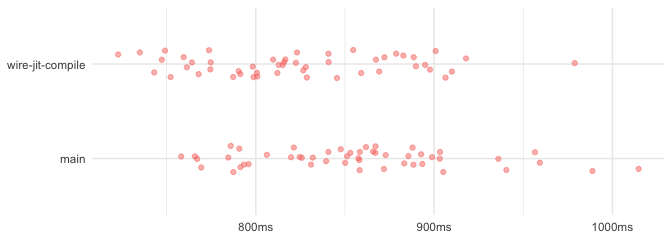

# Wiring `model(compile=)` through to `jit_compile`

## The question

`model(compile = TRUE)` is documented as applying XLA JIT compilation
but has been inert since January 2023. The `wire-jit-compile` branch
passes it through at the two `tf_function()` sites in `dag_class.R`.
Does that make greta faster?

Both branches resolve their own Python stack, recorded below, so a
difference here is the effect of the wiring rather than of a version
bump.

The model is a plain regression on purpose: XLA cannot compile the
gradients of `FillScaleTriL` or `CorrelationCholesky`, so `wishart()`,
`lkj_correlation()` and `cholesky_variable()` models error on the wired
branch instead of producing a timing.

## Results

| task | median_wire-jit-compile | median_main | itr/sec_wire-jit-compile | itr/sec_main |
|---:|---:|---:|---:|---:|
| build | 21.7ms | 21.4ms | 43.8 | 44.6 |
| mcmc_short | 816.2ms | 857.8ms | 1.2 | 1.2 |

Relative within each task, taking the faster branch as 1:

|       task |           branch |   min | median |
|-----------:|-----------------:|------:|-------:|
|      build | wire-jit-compile | 1.000 |  1.004 |
|      build |             main | 1.005 |  1.000 |
| mcmc_short | wire-jit-compile | 1.000 |  1.000 |
| mcmc_short |             main | 1.031 |  1.038 |

Figure 1: Every iteration of the sampling task, both branches, log
scale. The distributions overlap heavily - the difference is a shift in
a wide, noisy spread, not a clean separation.

## What this says

Sampling is **4.8% faster** on the wired branch: 816 ms against 858 ms,
a difference of 42 ms.

The spread is wide — a within-branch standard deviation of about 58 ms,
comparable to the effect itself — so this needs 50 iterations per branch
to see. A Welch test gives p = 0.0062, with a 95% interval on the
difference of 9 to 55 ms. **An earlier run at 10 iterations per branch
could not resolve it**, and gave estimates ranging from 27 ms to 62 ms;
treat any single small run of this comparison as uninformative.

Model definition is unchanged, which is what you would expect: XLA
compiles at first call, not at definition.

So the upside is real but modest, and it applies only to the models XLA
can handle.

## Environment

|  |  |
|:---|:---|
| run at | 2026-08-23 10:30:55 AEST |
| OS | macOS Tahoe 26.5.2 |
| system | aarch64, darwin23 |
| CPU | Apple M3 |
| cores detected | 8 |
| R | R version 4.6.1 (2026-06-24) |
| R package: bench | 1.1.4 (CRAN (R 4.6.0)) |
| R package: cross | 0.0.0.9000 (Github ([DavisVaughan/cross@1a0db276e1f14b404efa6305b7890ffe24690f1d](https://github.com/DavisVaughan/cross/commit/1a0db276e1f14b404efa6305b7890ffe24690f1d))) |
| R package: reticulate | 1.46.0 (CRAN (R 4.6.0)) |
| R package: tensorflow | 2.20.0 (CRAN (R 4.6.0)) |
| stack, wire-jit-compile | python 3.12 \| tensorflow 2.21.0 \| tfp 0.25.0 |
| stack, main | python 3.12 \| tensorflow 2.21.0 \| tfp 0.25.0 |
| greta, current | [`3b7027ed9eb11d293cd5e9bbfee1d7bf7b54e9b2`](https://github.com/greta-dev/greta/commit/3b7027ed9eb11d293cd5e9bbfee1d7bf7b54e9b2) |
| greta, reference | [`e8563dae0ef2b8be384fac023f62df1febf17ae6`](https://github.com/greta-dev/greta/commit/e8563dae0ef2b8be384fac023f62df1febf17ae6) |
