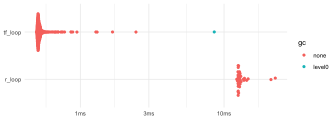

# What driving the optimiser loop from R costs


    # A tibble: 2 × 6
      expression   min median `itr/sec` mem_alloc `gc/sec`
      <bch:expr> <dbl>  <dbl>     <dbl>     <dbl>    <dbl>
    1 r_loop      24.8   24.8       1         NaN      NaN
    2 tf_loop      1      1        25.3       NaN      Inf

## The question

`tf_optimiser` and `tf_compat_optimiser` run a `while` loop in R,
stepping into TensorFlow once per iteration. `tfp_optimiser` does not.
What does the R-driven loop cost, and what would moving it into TF
actually buy?

## Part 1: `opt()` has a large fixed cost per iteration

Models taken from `inst/examples/`, which the `example_models` vignette
renders, plus one scaled-up regression to give the gradient real work to
do.

| model               | n_free | iterations | per iteration (ms) |
|:--------------------|-------:|-----------:|-------------------:|
| linear              |      3 |        100 |               0.89 |
| multiple_linear     |      8 |        100 |               0.96 |
| hierarchical_linear |      6 |        100 |               1.28 |
| wide_linear         |    202 |        100 |               1.40 |

The floor is about 0.89 ms an iteration. A model doing a 2000x200 matrix
multiply for every gradient reaches only 1.40 ms, so even there roughly
64% of the iteration is cost that does not come from the model.

Parameter count is not what drives it: `hierarchical_linear` has 6 free
parameters and costs more per iteration than `multiple_linear`’s 8,
because the graph is more involved rather than larger.

## Part 2: the ceiling, on identical arithmetic

greta removed. The same 200 gradient-descent steps, driven from R and
driven inside TF, so the difference is the cost of crossing back into R:

``` r
# one gradient-descent step on a scalar: identical work either way, so the
# difference between these two is the cost of crossing back into R each time
n_steps <- 200L

x_r <- tf$Variable(1, dtype = tf$float32)
step_once <- tf_function(function() {
  x_r$assign_sub(tf$constant(0.001, dtype = tf$float32) * (2 * x_r))
  x_r
})

r_driven <- function() {
  for (i in seq_len(n_steps)) step_once()
  x_r
}

x_tf <- tf$Variable(1, dtype = tf$float32)
tf_driven <- tf_function(function() {
  tf$while_loop(
    cond = function(i) tf$less(i, n_steps),
    body = function(i) {
      x_tf$assign_sub(tf$constant(0.001, dtype = tf$float32) * (2 * x_tf))
      list(tf$add(i, 1L))
    },
    loop_vars = list(tf$constant(0L))
  )
})
```

| expression |     min |  median |    itr/sec |
|-----------:|--------:|--------:|-----------:|
|     r_loop |  12.3ms |  12.7ms |   74.94935 |
|    tf_loop | 495.5µs | 512.7µs | 1868.81060 |

Relative, taking the fastest as 1:

| expression |  min | median | itr/sec |
|-----------:|-----:|-------:|--------:|
|     r_loop | 24.8 |   24.8 |     1.0 |
|    tf_loop |  1.0 |    1.0 |    25.3 |

<div id="fig-loop">



Figure 1: Every iteration of both loops, log scale. The two clusters do
not overlap: the TF-driven loop sits under 1 ms, the R-driven one above
10 ms.

</div>

Driving the loop inside TF is **25x** faster here, which puts the bare
round trip at about **0.061 ms per step**.

## What that means for the fix

The round trip is real but it is *not* most of what `opt()` spends per
iteration: 0.061 ms of round trip against 1.12 ms per `opt()` iteration,
so roughly 5% of it.

The rest is greta’s own loop body, which runs in R: the convergence
check, the `$numpy()` conversion of the objective, and
`check_numerical_overflow()`. So moving the `while` loop into TF only
pays if the body moves with it. Wrapping the loop alone and leaving the
body in R would recover the smaller share.

## Environment

|  |  |
|:---|:---|
| run at | 2026-08-23 10:33:13 AEST |
| OS | macOS Tahoe 26.5.2 |
| system | aarch64, darwin23 |
| CPU | Apple M3 |
| cores detected | 8 |
| R | R version 4.6.1 (2026-06-24) |
| R package: bench | 1.1.4 (CRAN (R 4.6.0)) |
| R package: cross | 0.0.0.9000 (Github ([DavisVaughan/cross@1a0db276e1f14b404efa6305b7890ffe24690f1d](https://github.com/DavisVaughan/cross/commit/1a0db276e1f14b404efa6305b7890ffe24690f1d))) |
| R package: reticulate | 1.46.0 (CRAN (R 4.6.0)) |
| R package: tensorflow | 2.20.0 (CRAN (R 4.6.0)) |
