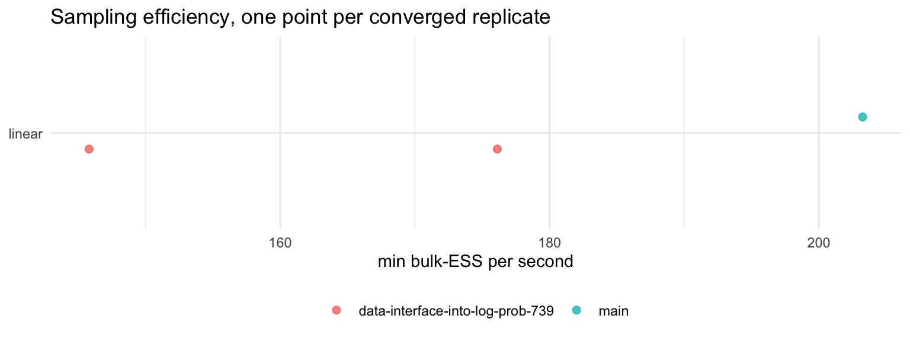
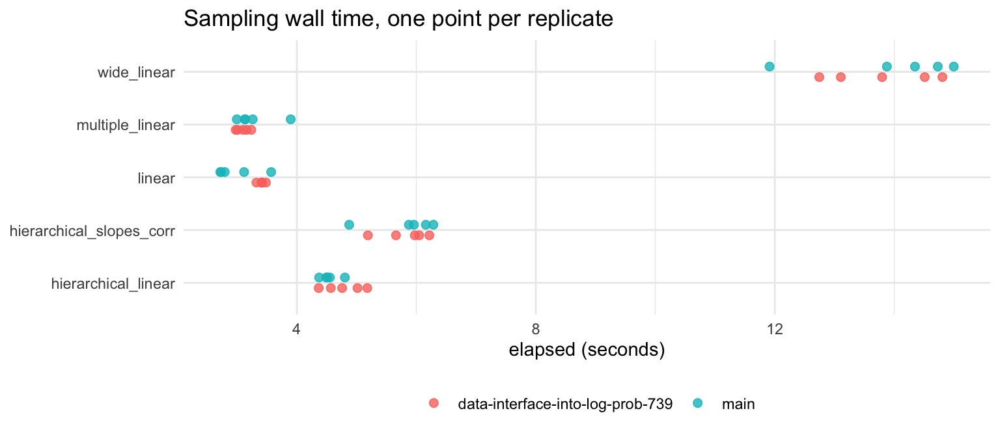
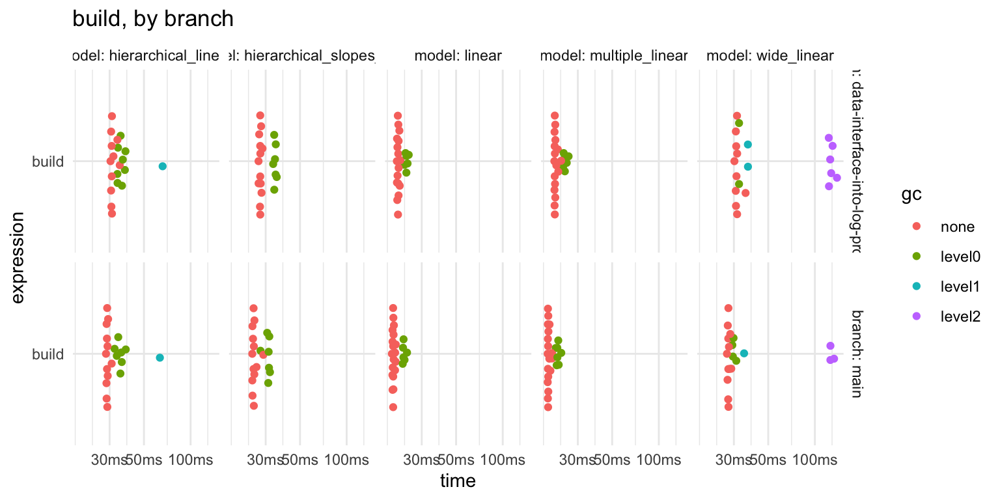
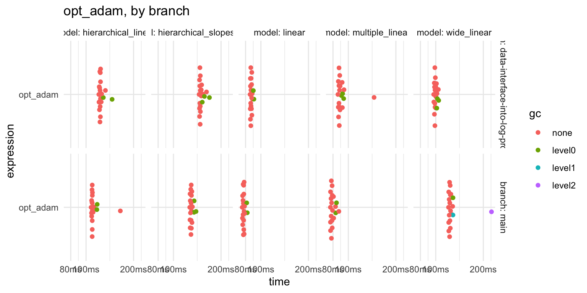

::: {.cell}

:::


4 chains, 1000 warmup,
1000 samples, 5 replicates per model;
20 iterations for the deterministic tier. These are greta's own defaults for
`sampler`, `n_samples` and `warmup`, so this is what a user gets without
asking for anything.


::: {.cell}
::: {.cell-output-display}


|role       |branch                           |sha        |
|:----------|:--------------------------------|:----------|
|reference  |main                             |280dc9068b |
|under test |data-interface-into-log-prob-739 |7875a3799d |


:::
:::


## What is being measured

Three tasks across two tiers. `mcmc()` and `opt()` share almost no code in
greta, so a change to one is invisible to the other, and `build` is the graph
construction both of them depend on.

| task | call | what it exercises |
|:-----|:-----|:------------------|
| `build` | the model function, ending in `model()` | defining the greta arrays and constructing the DAG, which is where the TensorFlow graph and its pointers are created. The cost paid once, before any inference |
| `opt_adam` | `opt(m, optimiser = adam(), max_iterations = 100)` | 100 iterations of maximum-likelihood optimisation |
| sampling | `mcmc(m, chains, warmup, n_samples)` | greta's default `hmc()` sampler |

### Why `adam()`, when `opt()` defaults to `bfgs()`

This is the one choice here that is not the default a user gets, so it needs a
reason. greta has two kinds of optimiser, and they differ in who drives the
loop:

- `adam()` is a `tf_optimiser` - a Keras optimiser that greta steps through
  from a `while` loop **in R**, crossing into TensorFlow once per iteration. At
  `max_iterations = 100` that is exactly 100 round trips, the same work on
  every run and on every branch.
- `bfgs()` is a `tfp_optimiser` - TFP runs the whole loop **inside the
  TensorFlow graph** and stops when it hits `tolerance = 1e-6`. The iteration
  count then depends on the data and the starting point, so timing it measures
  how quickly that model happened to converge.

`bench::mark()` needs each iteration to be the same amount of work, so `adam()`
is the one that can be timed honestly. The cost of that choice is worth stating
plainly: **the deterministic tier does not measure the default `opt()` path**,
and a change touching only `tfp_optimiser` would not show up here at all.

## Are the diagnostics trustworthy?

An earlier version of this harness reshaped greta's `mcmc.list` by hand and
scrambled chains against variables, so the Rhat it reported described the
reshape rather than the sampler. Everything below rests on that not happening
again, so `00-check-diagnostics.R` tests it. All
4 groups of checks pass:

- the coercion `posterior::as_draws_array()` preserves dimensions, variable
  names, and every draw element for element
- four iid normal chains give Rhat 1.002 and bulk-ESS
  1986, so the estimator is being called correctly
- four chains parked at different modes give Rhat
  2.84, so it can fail
- the old by-hand reshape, reproduced deliberately and run on chains known to
  be good, turns Rhat 1 and bulk-ESS
  1927 into Rhat
  2.41 and bulk-ESS
  5. That is the signature recorded
  against the original bug, and the coercion in use does not produce it.

`posterior::rhat()` is rank-normalised and folded; `coda`'s `psrf[, 1]` is the
classic estimator. They are different statistics, and only the first is in
`results.rds`, so it is worth seeing them side by side on the same draws:


::: {.cell}
::: {.cell-output-display}


|variable | rhat_posterior| rhat_coda_point| rhat_coda_upper|
|:--------|--------------:|---------------:|---------------:|
|int      |         2.4225|          3.5130|          6.0123|
|coef     |         1.1264|          1.1890|          1.4873|
|sd       |         1.0018|          1.0048|          1.0144|


:::
:::


::: {.cell}

:::


The two estimators differ in magnitude - they are not the same statistic, and
should not be expected to agree to a decimal place. What matters is that they
agree on the verdict, and on which way the difference runs: on the worst
variable the rank-normalised statistic reads
2.42 where `coda`'s classic point estimate
reads 3.51. The number in `results.rds` is
the **lower** of the two, so nothing there is inflated by the choice of
statistic. `coda`'s upper confidence limit `psrf[, 2]` is higher again at
6.01, which is why it is not what anyone
should quote - an error already recorded against greta #790.

## Did the chains converge?

Thresholds are from Vehtari et al. (2021):

- Rhat < 1.01,
- bulk-ESS > 400,
- at least four chains.

Failures here cannot be compared on speed. A chain that did not converge is not
a fast chain.

Reported as a distribution across replicates, not a worst case: quoting
`min(ESS)` and `max(rhat)` across five runs turns one bad replicate into an
apparent total failure.


::: {.cell}
::: {.cell-output-display}


|branch                           |model                    | vars| reps| converged| median min-ESS| median med-ESS| median max-Rhat|
|:--------------------------------|:------------------------|----:|----:|---------:|--------------:|--------------:|---------------:|
|data-interface-into-log-prob-739 |hierarchical_linear      |    6|    5|         0|            142|            304|           1.028|
|data-interface-into-log-prob-739 |hierarchical_slopes_corr |   13|    5|         0|              8|             15|           1.419|
|data-interface-into-log-prob-739 |linear                   |    3|    5|         2|            378|            393|           1.012|
|data-interface-into-log-prob-739 |multiple_linear          |    8|    5|         0|             61|            193|           1.079|
|data-interface-into-log-prob-739 |wide_linear              |  202|    5|         0|             14|           1797|           1.225|
|main                             |hierarchical_linear      |    6|    5|         0|             41|             59|           1.083|
|main                             |hierarchical_slopes_corr |   13|    5|         0|             11|             21|           1.310|
|main                             |linear                   |    3|    5|         1|            173|            182|           1.017|
|main                             |multiple_linear          |    8|    5|         0|             71|            319|           1.048|
|main                             |wide_linear              |  202|    5|         0|             12|           2916|           1.377|


:::
:::


Three things that table says, and one it does not:


::: {.cell}

:::


- 3 of 50 runs passed both thresholds, so
  47 are dropped from every comparison below.
- The two thresholds fail together rather than separately:
  44 of the 47 failures miss both, with
  2 failing on ESS alone and 1 on
  Rhat alone. Neither is the binding constraint - a run that mixes badly
  enough to miss one misses the other.
- Only linear ever passes.
  The other 4
  models fail on every replicate, on both branches.

What it does not say is that the gate is not the same test for every model. It
asks every variable to clear 400, which is 3 variables
for linear and 202 for
wide\_linear. The wide model is being asked a
much harder question under the same label.

That shows up in the gap between the two ESS columns above: on `wide_linear`
the median across variables is 2817 while
the minimum is 13. The model as a whole
mixes; a handful of its parameters do not. The harness does not record *which*
parameters, which is the first thing to add.

### The raw data

Every replicate, so the summaries above can be checked against what was
actually measured.


::: {.cell}
::: {.cell-output-display}


|branch                           |model                    | rep| elapsed| vars| ess_bulk_min| ess_bulk_median| ess_tail_min| n_below_400| rhat_max|
|:--------------------------------|:------------------------|---:|-------:|----:|------------:|---------------:|------------:|-----------:|--------:|
|data-interface-into-log-prob-739 |hierarchical_linear      |   1|    5.02|    6|        296.7|           431.3|        325.0|           3|    1.007|
|data-interface-into-log-prob-739 |hierarchical_linear      |   2|    4.37|    6|         22.7|            30.4|         55.8|           5|    1.132|
|data-interface-into-log-prob-739 |hierarchical_linear      |   3|    4.76|    6|        261.1|           390.1|        196.1|           3|    1.023|
|data-interface-into-log-prob-739 |hierarchical_linear      |   4|    5.18|    6|         74.0|           210.8|         79.0|           5|    1.049|
|data-interface-into-log-prob-739 |hierarchical_linear      |   5|    4.57|    6|        141.8|           304.2|        190.6|           4|    1.028|
|main                             |hierarchical_linear      |   1|    4.80|    6|         41.5|            59.1|         76.2|           5|    1.083|
|main                             |hierarchical_linear      |   2|    4.55|    6|         30.6|            54.7|         62.2|           5|    1.111|
|main                             |hierarchical_linear      |   3|    4.49|    6|         16.5|            38.9|         77.0|           5|    1.186|
|main                             |hierarchical_linear      |   4|    4.51|    6|        152.3|           224.8|        201.6|           5|    1.039|
|main                             |hierarchical_linear      |   5|    4.37|    6|         76.8|           129.0|        207.4|           5|    1.064|
|data-interface-into-log-prob-739 |hierarchical_slopes_corr |   1|    6.05|   13|          8.3|            18.9|         15.6|          10|    1.453|
|data-interface-into-log-prob-739 |hierarchical_slopes_corr |   2|    5.97|   13|         10.7|            15.2|         23.9|          10|    1.311|
|data-interface-into-log-prob-739 |hierarchical_slopes_corr |   3|    6.22|   13|          8.4|            15.5|         11.0|          11|    1.419|
|data-interface-into-log-prob-739 |hierarchical_slopes_corr |   4|    5.19|   13|          8.6|            23.3|         22.3|          10|    1.409|
|data-interface-into-log-prob-739 |hierarchical_slopes_corr |   5|    5.66|   13|          7.1|            11.8|         19.2|          10|    1.578|
|main                             |hierarchical_slopes_corr |   1|    6.28|   13|         13.9|            20.8|         33.1|          10|    1.240|
|main                             |hierarchical_slopes_corr |   2|    4.88|   13|          6.6|             9.2|         19.5|          10|    1.675|
|main                             |hierarchical_slopes_corr |   3|    6.16|   13|         11.0|            15.6|          6.9|          12|    1.310|
|main                             |hierarchical_slopes_corr |   4|    5.88|   13|         17.0|            35.3|         15.1|          10|    1.204|
|main                             |hierarchical_slopes_corr |   5|    5.96|   13|          9.2|            22.9|         21.3|          12|    1.365|
|data-interface-into-log-prob-739 |linear                   |   1|    3.42|    3|        190.7|           202.8|        281.0|           2|    1.016|
|data-interface-into-log-prob-739 |linear                   |   2|    3.41|    3|        496.8|           525.1|        801.4|           0|    1.007|
|data-interface-into-log-prob-739 |linear                   |   3|    3.48|    3|        613.2|           632.4|       1149.7|           0|    1.003|
|data-interface-into-log-prob-739 |linear                   |   4|    3.41|    3|        378.4|           392.9|        561.9|           2|    1.014|
|data-interface-into-log-prob-739 |linear                   |   5|    3.32|    3|        158.3|           168.0|        253.5|           2|    1.012|
|main                             |linear                   |   1|    3.12|    3|        395.1|           418.3|        598.2|           1|    1.007|
|main                             |linear                   |   2|    3.57|    3|        725.6|           739.3|       1220.0|           0|    1.006|
|main                             |linear                   |   3|    2.73|    3|         82.9|            86.0|        190.2|           2|    1.040|
|main                             |linear                   |   4|    2.72|    3|        134.7|           138.2|        332.0|           2|    1.034|
|main                             |linear                   |   5|    2.79|    3|        172.6|           181.6|        341.2|           2|    1.017|
|data-interface-into-log-prob-739 |multiple_linear          |   1|    2.98|    8|         39.3|            92.3|        100.6|           8|    1.079|
|data-interface-into-log-prob-739 |multiple_linear          |   2|    3.16|    8|         61.1|           194.2|        120.8|           7|    1.089|
|data-interface-into-log-prob-739 |multiple_linear          |   3|    3.01|    8|         23.0|           157.3|         27.2|           7|    1.146|
|data-interface-into-log-prob-739 |multiple_linear          |   4|    3.24|    8|         75.6|           296.3|        156.1|           6|    1.053|
|data-interface-into-log-prob-739 |multiple_linear          |   5|    3.10|    8|         66.0|           193.0|         87.6|           7|    1.076|
|main                             |multiple_linear          |   1|    3.90|    8|         72.2|           318.9|        107.7|           5|    1.035|
|main                             |multiple_linear          |   2|    3.14|    8|         66.3|           224.0|        104.5|           7|    1.065|
|main                             |multiple_linear          |   3|    3.13|    8|         70.9|           344.5|        167.4|           7|    1.039|
|main                             |multiple_linear          |   4|    3.26|    8|         86.5|           358.2|        163.9|           5|    1.048|
|main                             |multiple_linear          |   5|    3.00|    8|         13.8|           222.7|         45.5|           7|    1.235|
|data-interface-into-log-prob-739 |wide_linear              |   1|   14.51|  202|         13.9|          1797.1|         20.4|          14|    1.225|
|data-interface-into-log-prob-739 |wide_linear              |   2|   13.11|  202|        288.9|          3234.8|        141.7|           1|    1.098|
|data-interface-into-log-prob-739 |wide_linear              |   3|   14.80|  202|         40.6|          2811.7|         64.6|           1|    1.065|
|data-interface-into-log-prob-739 |wide_linear              |   4|   12.74|  202|          5.5|           428.2|         17.7|          88|    1.954|
|data-interface-into-log-prob-739 |wide_linear              |   5|   13.80|  202|          7.3|           400.5|         21.1|         101|    1.522|
|main                             |wide_linear              |   1|   13.88|  202|         45.0|          2988.3|         22.1|           2|    1.377|
|main                             |wide_linear              |   2|   15.00|  202|          8.6|          3498.1|         33.9|           6|    1.392|
|main                             |wide_linear              |   3|   14.73|  202|          8.6|          2915.8|         35.2|          13|    1.393|
|main                             |wide_linear              |   4|   14.35|  202|         11.7|          1268.9|         48.0|          21|    1.261|
|main                             |wide_linear              |   5|   11.91|  202|        661.3|          2821.4|        100.5|           0|    1.119|


:::
:::


## Sampling efficiency

Effective samples per second, on the converged runs only.


::: {.cell}
::: {.cell-output-display}


|model  |branch                           | runs| median|   min|   max|
|:------|:--------------------------------|----:|------:|-----:|-----:|
|linear |data-interface-into-log-prob-739 |    2|  161.0| 145.8| 176.1|
|linear |main                             |    1|  203.3| 203.3| 203.3|


:::
:::


### Is the difference resolved?

A ratio of medians sitting inside a spread wider than the effect is not a
finding, so this table is the one to read before the ratio.


::: {.cell}
::: {.cell-output-display}


|model  | ratio| runs on the thinner branch|verdict             |
|:------|-----:|--------------------------:|:-------------------|
|linear |  0.79|                          1|too few runs to say |


:::
:::


With 1 converged run on one branch and
2 on the other, there is no comparison here to
make. The gate is doing its job; there is almost nothing left after it.


::: {.cell}
::: {.cell-output-display}
{width=768}
:::
:::


## Wall time, for attribution

A gain in effective samples per second is only a sampling gain if the sampler
did not simply run longer or shorter. Tier 2 comes from `run_branches()` rather
than `bench::mark()`, so there is no `bench_mark` object to summarise here and
no columns bench computed - these are the raw `elapsed` seconds from every
replicate.


::: {.cell}
::: {.cell-output-display}
{width=768}
:::
:::


## Deterministic tier: build and optimise

This half is `bench::mark()` through `cross::bench_branches()`, so bench's own
summary and plot apply - and unlike the sampling tier, every cell here has a
result.

`summary(relative = TRUE)` normalises against the single fastest row in
whatever it is handed. Given the whole table it compares `opt_adam` on one
model against `build` on another, which is not a comparison anybody wants. So
it is applied per model and per expression, where the only thing varying is the
branch.


::: {.cell}
::: {.cell-output-display}


|model                    |expression | main (ms)| data-interface-into-log-prob-739 (ms)| main (rel)| data-interface-into-log-prob-739 (rel)|
|:------------------------|:----------|---------:|-------------------------------------:|----------:|--------------------------------------:|
|linear                   |build      |      19.6|                                  21.2|      1.000|                                  1.078|
|linear                   |opt_adam   |      77.6|                                  86.5|      1.000|                                  1.115|
|multiple_linear          |build      |      19.3|                                  21.3|      1.000|                                  1.105|
|multiple_linear          |opt_adam   |      78.6|                                  88.0|      1.000|                                  1.119|
|hierarchical_linear      |build      |      28.9|                                  31.0|      1.000|                                  1.072|
|hierarchical_linear      |opt_adam   |     109.4|                                 122.7|      1.000|                                  1.122|
|hierarchical_slopes_corr |build      |      25.1|                                  27.7|      1.000|                                  1.104|
|hierarchical_slopes_corr |opt_adam   |     129.3|                                 147.8|      1.000|                                  1.143|
|wide_linear              |build      |      27.6|                                  31.1|      1.000|                                  1.126|
|wide_linear              |opt_adam   |     122.7|                                  98.9|      1.241|                                  1.000|


:::
:::


::: {.cell}

:::


### What the relative columns mean

The faster branch in each row is 1.000 and the other is its multiple, so a
relative of 1\.126 means
12.6% slower. Every percentage
below is `(relative - 1) * 100` computed from this table, never typed in. The
absolute millisecond columns are there too, because a given percentage of a
19 ms build and of a
148 ms optimisation are not the same
size of problem.

Within each row the slower branch is the one above 1. Reading down the relative
columns:

- `build` is slower on data\-interface\-into\-log\-prob\-739 in 5 of
  5 models, by
  7 to
  13 per cent.
- `opt_adam` is slower in 4 of 5
  models, by up to
  14 per cent. The exception
  is wide\_linear, where the branch is
  24 per
  cent *faster* - the one cell pointing the other way, and the one with the
  most real gradient work in it.
- Unlike the sampling tier, every one of these 10 cells has
  a number, because the work is deterministic and there is no convergence gate
  to fail.

### Is the deterministic difference resolved?

The sampling tier has a resolution check and this one did not, which is the
wrong way round: this is the half with a finding in it. Each `bench::mark()`
cell holds its own per-iteration times, so the within-branch spread is already
measured and does not need a separate A/A run. Quartiles rather than min-max,
because a single slow iteration should not widen a branch's interval enough to
swallow the effect.


::: {.cell}
::: {.cell-output-display}


|model                    |expression | difference (ms)|main IQR (ms) |data-interface-into-log-prob-739 IQR (ms) | spread / effect|verdict    |
|:------------------------|:----------|---------------:|:-------------|:-----------------------------------------|---------------:|:----------|
|linear                   |build      |             1.5|19.6 - 20.4   |21 - 22.5                                 |             1.0|resolved   |
|linear                   |opt_adam   |             8.9|77.1 - 78.3   |86.1 - 87.6                               |             0.2|resolved   |
|multiple_linear          |build      |             2.1|19.2 - 21.6   |21.3 - 23.8                               |             1.2|unresolved |
|multiple_linear          |opt_adam   |             9.2|77.8 - 80.6   |87.3 - 91.5                               |             0.5|resolved   |
|hierarchical_linear      |build      |             4.4|28.9 - 34.4   |31 - 35.5                                 |             1.2|unresolved |
|hierarchical_linear      |opt_adam   |            13.5|109.1 - 110   |122 - 123.9                               |             0.1|resolved   |
|hierarchical_slopes_corr |build      |             2.6|25 - 30.8     |27.7 - 34.1                               |             2.5|unresolved |
|hierarchical_slopes_corr |opt_adam   |            18.4|128.1 - 130.8 |146.8 - 151.1                             |             0.2|resolved   |
|wide_linear              |build      |             4.1|27.6 - 30.2   |31.2 - 123.1                              |            22.5|resolved   |
|wide_linear              |opt_adam   |           -24.0|121.7 - 125   |98.6 - 101.2                              |             0.1|resolved   |


:::
:::


::: {.cell}

:::


The last two columns are read together. The verdict says whether the branches
separate at all; the ratio says whether the size of the difference means
anything, and a ratio far above 1 means a cell can be read for direction only.

- All 5 `opt_adam` cells resolve, at ratios of
  0.1 to
  0.5. Differences of
  8.9 to
  24 ms against IQRs a few ms
  wide, so both the direction and the size hold up.
- Only 2 of
  5 `build` cells resolve, at ratios up to
  22.5. Differences of
  1.5 to
  4.4 ms, so per cell the effect
  mostly sits inside the spread.

So the build penalty should not be quoted from any single model. What supports
it is direction: the branch is slower in all 5 of
5 models, which under a null of no difference is a one in
32 result. That is a real effect too small for this
number of iterations to resolve cell by cell, not an absent one - and raising
`GRETA_SUITE_ITERATIONS` is what would settle it.

The extreme case is wide\_linear / build on
data\-interface\-into\-log\-prob\-739: an IQR of 31.2 to
123.1 ms, a 4-fold spread that
no other cell comes near. It separates from the reference, so the direction
stands, but a middle quartile spanning
92 ms cannot support a
4.1 ms claim - hence a ratio of
22.5. This is the largest model in the
set and the one whose build allocates most, so the spread is more likely a
property of the cell than an accident of when it ran.

### The distributions behind those medians

One plot per expression, so each compares the two branches on like work rather
than putting `build` and `opt_adam` on a shared axis.


::: {.cell}
::: {.cell-output-display}
{width=768}
:::
:::


::: {.cell}
::: {.cell-output-display}
{width=768}
:::
:::


## Provenance


::: {.cell}
::: {.cell-output .cell-output-stdout}

```
List of 5
 $ run_at  : chr "2026-09-21 14:56:33 AEST"
 $ cpu     : chr "Apple M3"
 $ cores   : int 8
 $ platform:List of 11
  ..$ version : chr "R version 4.6.1 (2026-06-24)"
  ..$ os      : chr "macOS Tahoe 26.5.2"
  ..$ system  : chr "aarch64, darwin23"
  ..$ ui      : chr "X11"
  ..$ language: chr "(EN)"
  ..$ collate : chr "en_AU.UTF-8"
  ..$ ctype   : chr "en_AU.UTF-8"
  ..$ tz      : chr "Australia/Hobart"
  ..$ date    : chr "2026-09-21"
  ..$ pandoc  : chr "3.10 @ /opt/homebrew/bin/pandoc"
  ..$ quarto  : chr "1.9.36 @ /usr/local/bin/quarto"
  ..- attr(*, "class")= chr [1:2] "platform_info" "list"
 $ packages:Classes 'packages_info' and 'data.frame':	4 obs. of  11 variables:
  ..$ package      : chr [1:4] "bench" "cross" "reticulate" "tensorflow"
  ..$ ondiskversion: chr [1:4] "1.1.4" "0.0.0.9000" "1.47.0" "2.20.0"
  ..$ loadedversion: chr [1:4] "1.1.4" "0.0.0.9000" NA NA
  ..$ path         : chr [1:4] "/Library/Frameworks/R.framework/Versions/4.6/Resources/library/bench" "/Library/Frameworks/R.framework/Versions/4.6/Resources/library/cross" "/Library/Frameworks/R.framework/Versions/4.6/Resources/library/reticulate" "/Library/Frameworks/R.framework/Versions/4.6/Resources/library/tensorflow"
  ..$ loadedpath   : chr [1:4] "/Library/Frameworks/R.framework/Versions/4.6/Resources/library/bench" "/Library/Frameworks/R.framework/Versions/4.6/Resources/library/cross" NA NA
  ..$ attached     : logi [1:4] TRUE TRUE FALSE FALSE
  ..$ is_base      : logi [1:4] FALSE FALSE FALSE FALSE
  ..$ date         : chr [1:4] "2025-01-16" "2026-08-05" "2026-09-03" "2025-08-22"
  ..$ source       : chr [1:4] "CRAN (R 4.6.0)" "Github (DavisVaughan/cross@1a0db276e1f14b404efa6305b7890ffe24690f1d)" "CRAN (R 4.6.1)" "CRAN (R 4.6.0)"
  ..$ md5ok        : logi [1:4] NA NA NA NA
  ..$ library      : Factor w/ 2 levels "/Users/nick_1/Library/R/arm64/4.6/library",..: 2 2 2 2
```


:::
:::

