# Retracing on CRAN, main and greta#843


This report compares versions of greta, measured on one machine, at the
quick tier. Every number in it is read from the targets store
2026-10-01-retracing-i546/\_targets-quick. The first version listed is
the reference.

| version | git ref              | commit     | iterations per draw |
|:--------|:---------------------|:-----------|--------------------:|
| CRAN    | v0.6.0               | 026efd63c0 |                   2 |
| main    | main                 | 179021a818 |                   2 |
| \#843   | faster-hessians-i546 | 94ef91b919 |                   2 |

`mcmc()` takes a number of draws, and versions of greta can run
different numbers of iterations per draw: greta 0.6.0 runs two at
`thin = 1`. Each version’s iterations per draw is measured
(`R/iterations.R`), and every `mcmc()` call is given the number of draws
that makes the same number of iterations on every version.

For each model, each version is measured on:

1.  **Speed:** the time `model()`, `opt()`, and an `mcmc()` run of a
    fixed number of iterations take.
2.  **Efficiency:** the time `mcmc()` takes to reach a target effective
    sample size.
3.  **Agreement:** the difference between versions’ posterior means, in
    Monte Carlo standard errors.
4.  **Convergence:** R-hat and effective sample size of one seeded fit.

Section 5 plots each model’s fitted values and posterior densities, and
section 6 holds any measurements particular to this run. Every `mcmc()`
call uses `hmc()`, greta’s default sampler.

This report compares versions with each other. Whether a version’s
answers are correct is tested in greta itself, in
`tests/testthat/test_posteriors_*.R`: each sampler’s draws are compared
with draws taken from the distribution directly, and Geweke tests check
that alternating between sampling a model’s parameters and simulating
its data keeps their joint distribution.

# The models

Each model is defined in maths and in greta code, and comes from greta’s
`inst/examples/`. Normal and log-normal distributions are written with
their mean and standard deviation, as greta’s `normal()` and
`lognormal()` take them; $\text{Cauchy}^{+}$ is a Cauchy truncated to
positive values. A model’s parameter count is the number of values
`mcmc()` returns for it.

## linear

A regression of each department’s rating in `attitude` on its number of
complaints. Parameters: 3.

$$\begin{aligned}
\text{rating}_i &\sim \text{Normal}(\mu_i, \sigma), \quad i = 1, \dots, 30 \\
\mu_i &= \alpha + \beta \, \text{complaints}_i \\
\alpha, \beta &\sim \text{Normal}(0, 10) \\
\sigma &\sim \text{Cauchy}^{+}(0, 3)
\end{aligned}$$

``` r
int <- normal(0, 10)
coef <- normal(0, 10)
sd <- cauchy(0, 3, truncation = c(0, Inf))
mu <- int + coef * attitude$complaints
distribution(attitude$rating) <- normal(mu, sd)
m <- model(int, coef, sd)
```

## multiple_linear

The same rating on all six of `attitude`’s other columns, $X$, through a
matrix multiply. Parameters: 8.

$$\begin{aligned}
\text{rating}_i &\sim \text{Normal}(\mu_i, \sigma), \quad i = 1, \dots, 30 \\
\mu_i &= \alpha + \sum_{j = 1}^{6} X_{ij} \, \beta_j \\
\alpha, \beta_j &\sim \text{Normal}(0, 10) \\
\sigma &\sim \text{Cauchy}^{+}(0, 3)
\end{aligned}$$

``` r
design <- as.matrix(attitude[, 2:7])
int <- normal(0, 10)
coefs <- normal(0, 10, dim = ncol(design))
sd <- cauchy(0, 3, truncation = c(0, Inf))
mu <- int + design %*% coefs
distribution(attitude$rating) <- normal(mu, sd)
m <- model(int, coefs, sd)
```

## hierarchical_linear

Sepal length on sepal width in `iris`, with an offset for each species,
$s[i]$ being flower $i$’s. Setosa’s offset is zero and the other two
share a scale, $\tau$. The offsets are indexed with `rbind()` and
integer indexing. Parameters: 6.

$$\begin{aligned}
\text{Sepal.Length}_i &\sim \text{Normal}(\mu_i, \sigma), \quad i = 1, \dots, 150 \\
\mu_i &= \alpha + \beta \, \text{Sepal.Width}_i + \gamma_{s[i]} \\
\gamma_1 &= 0, \qquad \gamma_2, \gamma_3 \sim \text{Normal}(0, \tau) \\
\tau &\sim \text{LogNormal}(0, 1) \\
\alpha, \beta &\sim \text{Normal}(0, 10) \\
\sigma &\sim \text{Cauchy}^{+}(0, 3)
\end{aligned}$$

``` r
int <- normal(0, 10)
coef <- normal(0, 10)
sd <- cauchy(0, 3, truncation = c(0, Inf))
species_sd <- lognormal(0, 1)
species_offset <- normal(0, species_sd, dim = 2)
species_effect <- rbind(0, species_offset)
species_id <- as.numeric(iris$Species)
mu <- int + coef * iris$Sepal.Width + species_effect[species_id]
distribution(iris$Sepal.Length) <- normal(mu, sd)
m <- model(int, coef, sd, species_sd, species_offset)
```

## eight_schools

The effect of coaching in eight schools, $y_j$, each measured with a
known standard error, $\sigma_j$. The scale of the school effects,
$\sigma_\eta$, is itself a parameter, which makes the posterior a
funnel. Parameters: 11.

$$\begin{aligned}
y_j &\sim \text{Normal}(\theta_j, \sigma_j), \quad j = 1, \dots, 8 \\
\theta_j &= \mu + \xi \, \eta_j \\
\eta_j &\sim \text{Normal}(0, \sigma_\eta) \\
\sigma_\eta &\sim \text{InverseGamma}(1, 1) \\
\mu &\sim \text{Normal}(0, 100) \\
\xi &\sim \text{Normal}(0, 5)
\end{aligned}$$

``` r
y <- c(28, 8, -3, 7, -1, 1, 18, 12)
sigma_y <- c(15, 10, 16, 11, 9, 11, 10, 18)
N <- length(y)
sigma_eta <- inverse_gamma(1, 1)
eta <- normal(0, sigma_eta, dim = N)
mu_theta <- normal(0, 100)
xi <- normal(0, 5)
theta <- mu_theta + xi * eta
distribution(y) <- normal(theta, sigma_y)
m <- model(sigma_eta, eta, mu_theta, xi)
```

## cjs

A Cormack-Jolly-Seber capture-recapture model: survival, $\phi_t$, and
recapture, $p_t$, on each of 20 occasions, from the simulated capture
histories $y_{it}$ of 100 animals. Animal $i$ is first caught on
occasion $f_i$ and last on $l_i$, so it is known to be alive on every
occasion between. $\chi_t$ is the probability that an animal alive on
occasion $t$ is never seen again, built by a recursion over the 19
earlier occasions. Not measured at the quick tier.

$$\begin{aligned}
\phi_t, \, p_t &\sim \text{Beta}(1, 1), \quad t = 1, \dots, 20 \\
\chi_{20} &= 1, \qquad \chi_t = (1 - \phi_t) + \phi_t \, (1 - p_{t + 1}) \, \chi_{t + 1} \\
1 &\sim \text{Bernoulli}(\phi_{t - 1}), \quad f_i < t \le l_i \\
y_{it} &\sim \text{Bernoulli}(p_t), \quad f_i < t \le l_i \\
1 &\sim \text{Bernoulli}(\chi_{l_i}), \quad \text{if } l_i < 20
\end{aligned}$$

``` r
set.seed(2026)
n_obs <- 100
n_time <- 20
y <- matrix(
  sample(c(0, 1), size = n_obs * n_time, replace = TRUE),
  ncol = n_time
)

first_obs <- apply(y, 1, function(x) min(which(x > 0)))
final_obs <- apply(y, 1, function(x) max(which(x > 0)))
obs_id <- apply(
  y,
  1,
  function(x) {
    seq(min(which(x > 0)), max(which(x > 0)), by = 1)[-1]
  }
)
obs_id <- unlist(obs_id)
capture_vec <- apply(
  y,
  1,
  function(x) x[min(which(x > 0)):max(which(x > 0))][-1]
)
capture_vec <- unlist(capture_vec)

phi <- beta(1, 1, dim = n_time)
p <- beta(1, 1, dim = n_time)

chi <- ones(n_time)
for (i in seq_len(n_time - 1)) {
  tn <- n_time - i
  chi[tn] <- (1 - phi[tn]) + phi[tn] * (1 - p[tn + 1]) * chi[tn + 1]
}

alive_data <- ones(length(obs_id))
not_seen_last <- final_obs != n_time
final_observation <- ones(sum(not_seen_last))

distribution(alive_data) <- bernoulli(phi[obs_id - 1])
distribution(capture_vec) <- bernoulli(p[obs_id])
distribution(final_observation) <- bernoulli(
  chi[final_obs[not_seen_last]]
)

m <- model(phi, p)
```

# 1. Speed

Each version runs these calls on each model, where `k` is the version’s
iterations per draw. `model()` and `opt()` are repeated between 10 and
20 times, and `mcmc()` between 5 and 10 times, all in one process per
version, after each model has been built and traced once.

``` r
model()
opt(m, optimiser = adam(), max_iterations = 100)
mcmc(m, warmup = 2000 / k, n_samples = 2000 / k, chains = 4, n_cores = 4)
```

<div id="fig-speed">

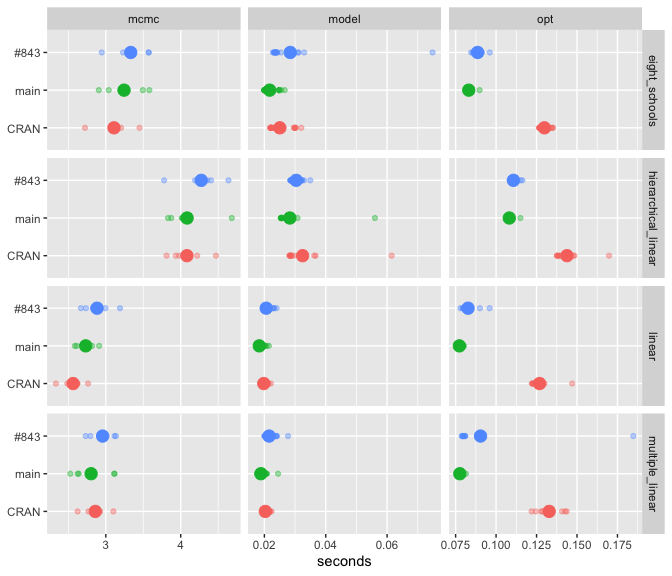

Figure 1: Every timed repeat, one row per version: the small dots are
single repeats and the large dot is their mean. The rows in a panel do
the same calls, so a row further right took longer. Panels are different
tasks and models, on their own scales.

</div>

<details>

<summary>

Table of the median, minimum and maximum, in milliseconds
</summary>

| task | example | CRAN | main | \#843 |
|:---|:---|:---|:---|:---|
| mcmc | eight_schools | 3250.4 (3108.3-4856.3) | 3318.8 (2798.1-3450.6) | 3290.0 (3095.5-3561.2) |
| mcmc | hierarchical_linear | 4051.9 (3812.8-4617.1) | 4197.1 (3835.5-4537.8) | 4308.5 (4232.4-4634.0) |
| mcmc | linear | 2864.6 (2615.5-3428.6) | 2919.5 (2850.0-3321.6) | 2772.9 (2476.5-2950.0) |
| mcmc | multiple_linear | 3064.1 (2479.5-3090.9) | 3162.4 (2518.9-4475.5) | 2927.2 (2823.0-2979.9) |
| model | eight_schools | 22.7 (21.9-30.7) | 21.1 (20.1-28.0) | 22.1 (21.6-54.2) |
| model | hierarchical_linear | 29.4 (28.6-61.9) | 25.9 (25.4-57.2) | 28.8 (27.9-33.5) |
| model | linear | 19.7 (19.0-22.1) | 18.8 (17.7-22.6) | 19.7 (19.2-25.4) |
| model | multiple_linear | 23.1 (21.4-109.0) | 20.1 (18.1-36.3) | 25.1 (19.7-118.7) |
| opt | eight_schools | 135.2 (126.8-140.8) | 85.8 (84.5-146.4) | 81.1 (79.7-88.6) |
| opt | hierarchical_linear | 141.6 (137.5-148.3) | 107.6 (106.5-114.9) | 104.7 (103.6-108.8) |
| opt | linear | 126.1 (124.2-155.6) | 89.7 (76.9-188.3) | 76.1 (74.0-79.2) |
| opt | multiple_linear | 131.3 (123.9-153.5) | 77.9 (75.8-81.5) | 83.4 (78.6-176.2) |

</details>

<details>

<summary>

Table of the ratio of medians for each pair of versions: the first
version named over the second
</summary>

| example             | task  | main vs CRAN | \#843 vs CRAN | \#843 vs main |
|:--------------------|:------|-------------:|--------------:|--------------:|
| eight_schools       | mcmc  |         1.02 |          1.01 |          0.99 |
| hierarchical_linear | mcmc  |         1.04 |          1.06 |          1.03 |
| linear              | mcmc  |         1.02 |          0.97 |          0.95 |
| multiple_linear     | mcmc  |         1.03 |          0.96 |          0.93 |
| eight_schools       | model |         0.93 |          0.98 |          1.05 |
| hierarchical_linear | model |         0.89 |          0.99 |          1.11 |
| linear              | model |         0.96 |          1.00 |          1.04 |
| multiple_linear     | model |         0.87 |          1.00 |          1.14 |
| eight_schools       | opt   |         0.66 |          0.62 |          0.94 |
| hierarchical_linear | opt   |         0.76 |          0.74 |          0.97 |
| linear              | opt   |         0.71 |          0.61 |          0.86 |
| multiple_linear     | opt   |         0.60 |          0.64 |          1.07 |

</details>

# 2. Efficiency

Seconds of sampling per 1000 effective draws: `mcmc()` with 2000 warmup
and 2000 sampling iterations, then `extra_samples()` until the smallest
bulk ESS over the model’s variables reaches 200 and every R-hat is below
1.01, or until the tier’s time limit. A run that reaches the time limit
is marked `hit_cap` in the table of sampling runs under Details.

<div id="fig-sampling">

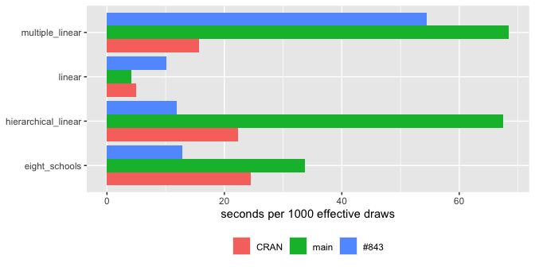

Figure 2: Seconds of sampling per 1000 effective draws. With one run per
version and model, a bar is that run; with several, the small dots are
runs and the large dot is their mean.

</div>

<details>

<summary>

Table of the median for each version, the ratio of medians for each
pair, and the number of runs
</summary>

| model | CRAN (s) | main (s) | \#843 (s) | main vs CRAN | \#843 vs CRAN | \#843 vs main | runs |
|:---|---:|---:|---:|---:|---:|---:|---:|
| eight_schools | 24.43 | 33.77 | 12.88 | 1.38 | 0.53 | 0.38 | 1 |
| hierarchical_linear | 22.26 | 67.51 | 11.88 | 3.03 | 0.53 | 0.18 | 1 |
| linear | 4.94 | 4.15 | 10.10 | 0.84 | 2.04 | 2.43 | 1 |
| multiple_linear | 15.64 | 68.49 | 54.49 | 4.38 | 3.48 | 0.80 | 1 |

</details>

## Memory

| version | RSS (MB) |
|:--------|---------:|
| CRAN    |     1178 |
| main    |     1191 |
| \#843   |     1121 |

- RSS is resident set size: the physical memory the measuring process
  held, in MB.
- It is read once, at the end of each version’s run, so it covers every
  task together, and it is not a peak.
- It is used rather than `bench`’s `mem_alloc`, which sees only R’s
  memory. Most of greta’s memory is held by TensorFlow, on the Python
  side.

# 3. Agreement

For each variable, the difference between two versions’ posterior means,
divided by the Monte Carlo standard error of that difference (Vehtari et
al. 2021; Magnusson et al. 2025), from the runs in section 2:

$$z = \frac{\bar\theta_{\text{test}} - \bar\theta_{\text{ref}}}{\sqrt{\text{mcse}^2_{\text{test}} + \text{mcse}^2_{\text{ref}}}}$$

The tables label a variable as disagreeing when $|z| > 4$.

<div id="fig-agreement">

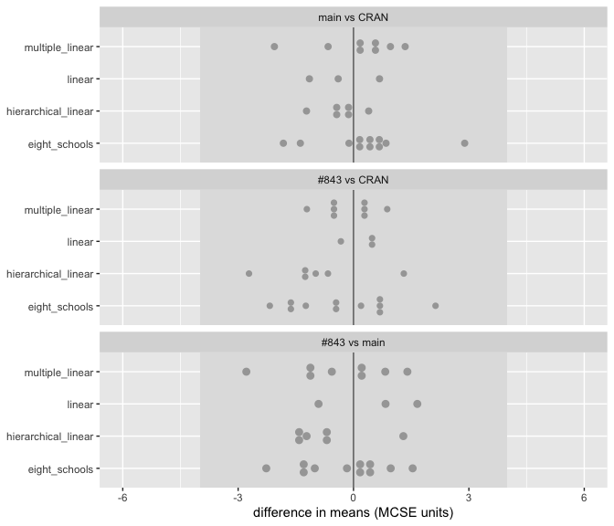

Figure 3: Every variable’s difference in means, in MCSE units, for each
pair of versions. The shaded band is \|z\| up to 4.

</div>

<details>

<summary>

Table of the largest \|z\| for each model and pair of versions
</summary>

| comparison | model | variables | largest \|z\| | variables with \|z\| \> 4 | variable with the largest \|z\| | label |
|:---|:---|---:|---:|---:|:---|:---|
| main vs CRAN | eight_schools | 11 | 2.89 | 0 | xi | agree within Monte Carlo error |
| main vs CRAN | hierarchical_linear | 6 | 1.22 | 0 | species_sd | agree within Monte Carlo error |
| main vs CRAN | linear | 3 | 1.15 | 0 | sd | agree within Monte Carlo error |
| main vs CRAN | multiple_linear | 8 | 2.06 | 0 | int | agree within Monte Carlo error |
| \#843 vs CRAN | eight_schools | 11 | 2.18 | 0 | eta\[5,1\] | agree within Monte Carlo error |
| \#843 vs CRAN | hierarchical_linear | 6 | 2.72 | 0 | species_sd | agree within Monte Carlo error |
| \#843 vs CRAN | linear | 3 | 0.48 | 0 | int | agree within Monte Carlo error |
| \#843 vs CRAN | multiple_linear | 8 | 1.21 | 0 | sd | agree within Monte Carlo error |
| \#843 vs main | eight_schools | 11 | 2.27 | 0 | sigma_eta | agree within Monte Carlo error |
| \#843 vs main | hierarchical_linear | 6 | 1.47 | 0 | species_offset\[2,1\] | agree within Monte Carlo error |
| \#843 vs main | linear | 3 | 1.66 | 0 | sd | agree within Monte Carlo error |
| \#843 vs main | multiple_linear | 8 | 2.79 | 0 | sd | agree within Monte Carlo error |

</details>

# 4. Convergence

R-hat and effective sample size over each model’s variables, for one
seeded fit of each model on each version: 4 chains of 2000 warmup and
2000 sampling iterations. Versions whose `mcmc()` follows `set.seed()`
start from the same random numbers; greta 0.6.0’s does not.

<div id="fig-diagnostics">

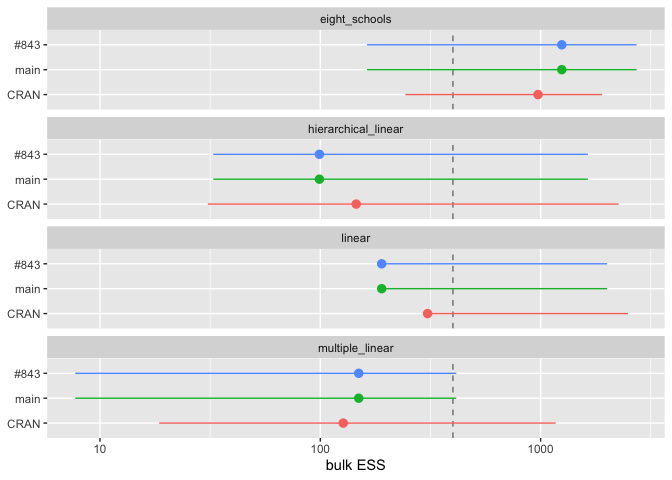

Figure 4: Bulk ESS of each fit over the model’s variables: the line runs
from the smallest to the largest, the point is the median. The dashed
line is 400. Log scale.

</div>

<details>

<summary>

Table of R-hat and ESS for each fit
</summary>

| model | version | largest R-hat | bulk ESS, min | bulk ESS, median | bulk ESS, max | tail ESS, min |
|:---|:---|---:|---:|---:|---:|---:|
| eight_schools | CRAN | 1.019 | 243 | 973 | 1903 | 225 |
| eight_schools | main | 1.022 | 163 | 1247 | 2727 | 81 |
| eight_schools | \#843 | 1.022 | 163 | 1247 | 2727 | 81 |
| hierarchical_linear | CRAN | 1.105 | 31 | 146 | 2263 | 115 |
| hierarchical_linear | main | 1.129 | 33 | 99 | 1639 | 70 |
| hierarchical_linear | \#843 | 1.129 | 33 | 99 | 1639 | 70 |
| linear | CRAN | 1.014 | 299 | 307 | 2491 | 492 |
| linear | main | 1.028 | 185 | 190 | 2003 | 381 |
| linear | \#843 | 1.028 | 185 | 190 | 2003 | 381 |
| multiple_linear | CRAN | 1.186 | 19 | 127 | 1170 | 58 |
| multiple_linear | main | 1.515 | 8 | 149 | 414 | 22 |
| multiple_linear | \#843 | 1.515 | 8 | 149 | 414 | 22 |

</details>

# 5. Fits

The fits from section 4. Each version is a colour. The fitted values are
each model’s expected value for the data, such as its regression line,
not new data simulated from the model. The data are the black points.

## linear

<div id="fig-fit-linear">

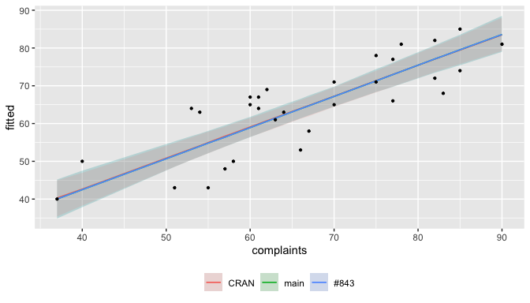

Figure 5: The fitted line’s median and 95% interval.

</div>

<div id="fig-densities-linear">

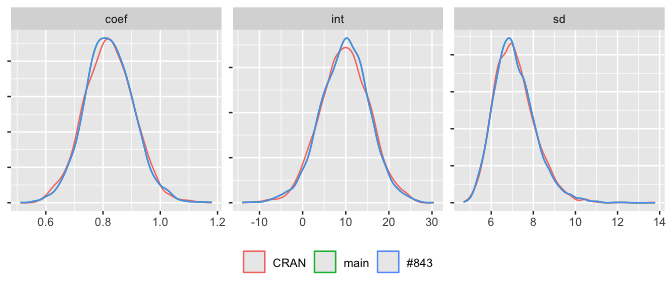

Figure 6: Posterior densities.

</div>

## multiple_linear

<div id="fig-fit-multiple-linear">

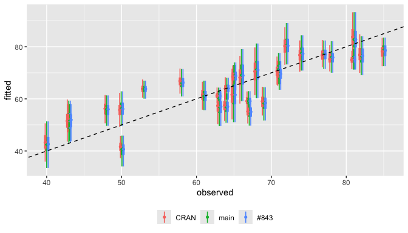

Figure 7: Each fitted value’s median, 50% and 95% intervals, against the
value it fits. The dashed line is where the two are equal.

</div>

<div id="fig-densities-multiple-linear">

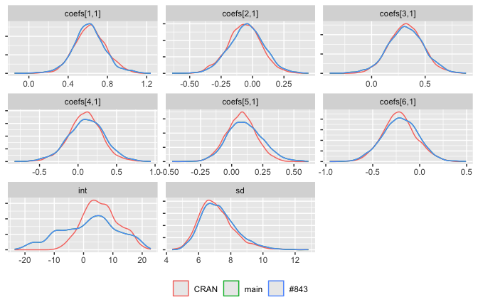

Figure 8: Posterior densities.

</div>

## hierarchical_linear

<div id="fig-fit-hierarchical-linear">

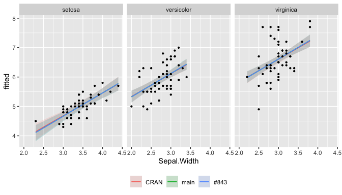

Figure 9: The fitted line’s median and 95% interval, by species.

</div>

<div id="fig-densities-hierarchical-linear">

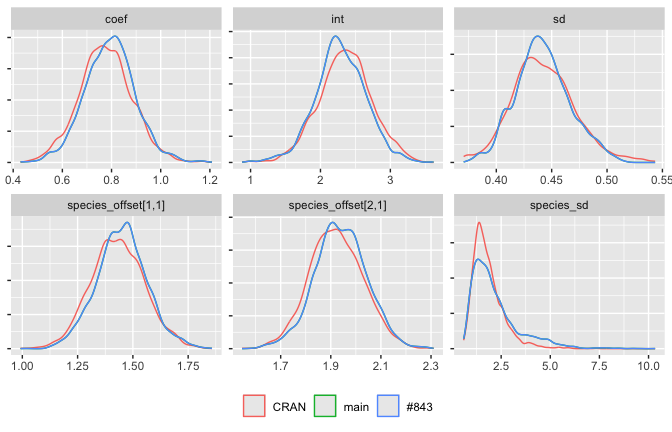

Figure 10: Posterior densities.

</div>

## eight_schools

<div id="fig-fit-eight-schools">

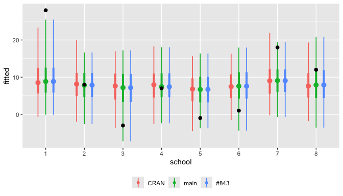

Figure 11: Each school’s estimated effect: median, 50% and 95%
intervals. The black points are the observed effects.

</div>

<div id="fig-densities-eight-schools">

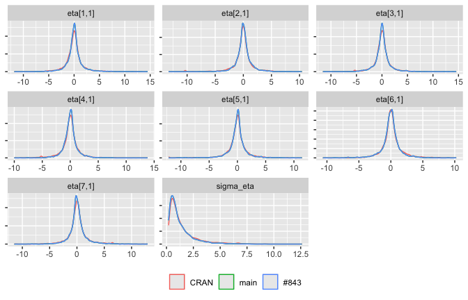

Figure 12: Posterior densities of the first eight variables.

</div>

## cjs

Not measured at the quick tier.

# 6. Further measurements

## One run of each model, first call in a session

The same document, `single-run.qmd`, rendered against each version by
`01-single-runs.R`, each with only that version installed:

- CRAN: [html](single-run-v0.6.0.html),
  [markdown](single-run-v0.6.0.md), at
  [026efd63](https://github.com/greta-dev/greta/commit/026efd63c08893f65de582b232c0748afaf72127)
- main: [html](single-run-main.html), [markdown](single-run-main.md), at
  [179021a8](https://github.com/greta-dev/greta/commit/179021a818cd7282896c42b03814a53556c1d98d)
- \#843: [html](single-run-faster-hessians-i546.html),
  [markdown](single-run-faster-hessians-i546.md), at
  [94ef91b9](https://github.com/greta-dev/greta/commit/94ef91b919300d33474aa3273cbb1f49cb989373)

Each runs the five models above with `mcmc()`, 4 chains of 1000 warmup
and 1000 samples, as the first call in its R session, so the time
includes tracing. It records how many times each of the model’s three
traced functions was traced, and how many retracing warnings TensorFlow
logged. One run each.

<div id="fig-traces">

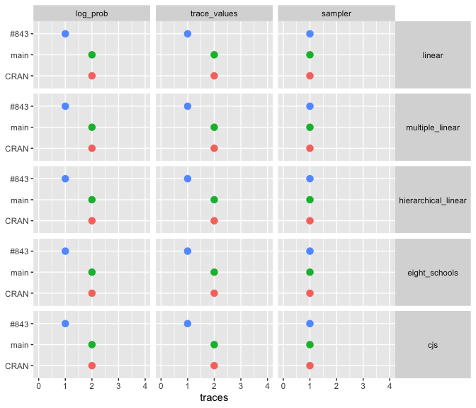

Figure 13: How many times each of the model’s traced functions was
traced during one mcmc() run.

</div>

<div id="fig-single-seconds">

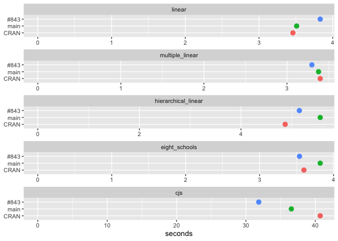

Figure 14: Seconds for one mcmc() run, first call in its session,
tracing included. Each model has its own scale, starting at zero.

</div>

<details>

<summary>

Table of the single runs
</summary>

| model | version | seconds | retracing warnings | log-prob traces | trace-values traces | sampler traces |
|:---|:---|---:|---:|---:|---:|---:|
| linear | CRAN | 3.46 | 0 | 2 | 2 | 1 |
| linear | main | 3.51 | 0 | 2 | 2 | 1 |
| linear | \#843 | 3.83 | 0 | 1 | 1 | 1 |
| multiple_linear | CRAN | 3.40 | 0 | 2 | 2 | 1 |
| multiple_linear | main | 3.38 | 0 | 2 | 2 | 1 |
| multiple_linear | \#843 | 3.30 | 0 | 1 | 1 | 1 |
| hierarchical_linear | CRAN | 4.87 | 0 | 2 | 2 | 1 |
| hierarchical_linear | main | 5.56 | 0 | 2 | 2 | 1 |
| hierarchical_linear | \#843 | 5.15 | 0 | 1 | 1 | 1 |
| eight_schools | CRAN | 3.60 | 0 | 2 | 2 | 1 |
| eight_schools | main | 3.82 | 0 | 2 | 2 | 1 |
| eight_schools | \#843 | 3.54 | 0 | 1 | 1 | 1 |
| cjs | CRAN | 40.71 | 0 | 2 | 2 | 1 |
| cjs | main | 36.55 | 0 | 2 | 2 | 1 |
| cjs | \#843 | 31.85 | 0 | 1 | 1 | 1 |

</details>

## opt(hessian = TRUE) on twenty scalar targets

The model greta#546 reported: twenty observations $y_k$, simulated, each
with its own mean $b_k$, so `opt(hessian = TRUE)` takes twenty hessians.
greta’s `variable()` gives $b_k$ a flat prior, so it has no distribution
line.

$$y_k \sim \text{Normal}(b_k, 1), \quad k = 1, \dots, 20$$

``` r
set.seed(2026 - 09 - 29)
y <- rnorm(20)

# twenty separate scalar parameters, b1 to b20
target_names <- paste0("b", 1:20)
for (name in target_names) {
  assign(name, variable())
}
distribution(y) <- normal(do.call(c, mget(target_names)), 1)

# model() names its targets from the expressions it is given, so the call is
# built from the names: this is model(b1, b2, ..., b20)
m <- eval(as.call(c(quote(model), lapply(target_names, as.name))))
```

`opt(m, hessian = TRUE)`, timed as the first call in its session in the
same documents:

| version | seconds | retracing warnings |
|:--------|--------:|-------------------:|
| CRAN    |   10.99 |                  2 |
| main    |   12.09 |                  2 |
| \#843   |    1.75 |                  0 |

# Details

<div class="panel-tabset">

## Sampling runs

|  | version | example | rep | elapsed | mcmc_iterations | ess_bulk_min | ess_bulk_median | rhat_max | n_variables | hit_cap |
|:---|:---|:---|---:|---:|---:|---:|---:|---:|---:|:---|
| linear…1 | CRAN | linear | 1 | 3.30 | 2000 | 668.68 | 668.82 | 1.00 | 3 | FALSE |
| multiple_linear…2 | CRAN | multiple_linear | 1 | 9.43 | 13066 | 602.96 | 1186.39 | 1.01 | 8 | FALSE |
| hierarchical_linear…3 | CRAN | hierarchical_linear | 1 | 9.85 | 5466 | 442.58 | 568.81 | 1.01 | 6 | FALSE |
| eight_schools…4 | CRAN | eight_schools | 1 | 8.23 | 5804 | 336.94 | 4049.44 | 1.01 | 11 | FALSE |
| linear…5 | main | linear | 1 | 3.72 | 2000 | 896.80 | 951.41 | 1.00 | 3 | FALSE |
| multiple_linear…6 | main | multiple_linear | 1 | 26.09 | 42000 | 380.95 | 5022.17 | 1.00 | 8 | FALSE |
| hierarchical_linear…7 | main | hierarchical_linear | 1 | 41.23 | 25358 | 610.62 | 1990.53 | 1.01 | 6 | FALSE |
| eight_schools…8 | main | eight_schools | 1 | 25.57 | 14534 | 757.21 | 1557.25 | 1.01 | 11 | FALSE |
| linear…9 | \#843 | linear | 1 | 3.76 | 3000 | 372.38 | 393.21 | 1.01 | 3 | FALSE |
| multiple_linear…10 | \#843 | multiple_linear | 1 | 22.68 | 18022 | 416.15 | 1780.45 | 1.01 | 8 | FALSE |
| hierarchical_linear…11 | \#843 | hierarchical_linear | 1 | 5.57 | 2600 | 468.82 | 688.11 | 1.01 | 6 | FALSE |
| eight_schools…12 | \#843 | eight_schools | 1 | 5.30 | 4054 | 411.19 | 4065.57 | 1.01 | 11 | FALSE |

## Posteriors

The mean and 90% interval, the 5% to 95% quantiles, of each model’s six
widest variables, from the runs in section 2.

<div id="fig-intervals">

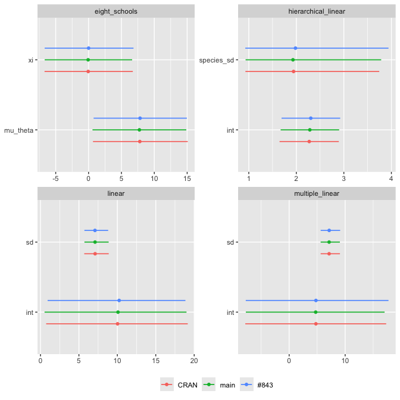

Figure 15

</div>

## Provenance

    List of 5
     $ run_at  : chr "2026-10-02 11:32:29 AEST"
     $ cpu     : chr "Apple M3"
     $ cores   : int 8
     $ platform:List of 11
      ..$ version : chr "R version 4.6.1 (2026-06-24)"
      ..$ os      : chr "macOS Tahoe 26.5.2"
      ..$ system  : chr "aarch64, darwin23"
      ..$ ui      : chr "X11"
      ..$ language: chr "(EN)"
      ..$ collate : chr "en_AU.UTF-8"
      ..$ ctype   : chr "en_AU.UTF-8"
      ..$ tz      : chr "Australia/Hobart"
      ..$ date    : chr "2026-10-02"
      ..$ pandoc  : chr "3.10 @ /opt/homebrew/bin/ (via rmarkdown)"
      ..$ quarto  : chr "1.9.36 @ /usr/local/bin/quarto"
      ..- attr(*, "class")= chr [1:2] "platform_info" "list"
     $ packages:Classes 'packages_info' and 'data.frame':   4 obs. of  11 variables:
      ..$ package      : chr [1:4] "bench" "cross" "reticulate" "tensorflow"
      ..$ ondiskversion: chr [1:4] "1.1.4" "0.0.0.9000" "1.47.0" "2.20.0"
      ..$ loadedversion: chr [1:4] "1.1.4" "0.0.0.9000" NA NA
      ..$ path         : chr [1:4] "/Library/Frameworks/R.framework/Versions/4.6/Resources/library/bench" "/Library/Frameworks/R.framework/Versions/4.6/Resources/library/cross" "/Users/nick_1/Library/R/arm64/4.6/library/reticulate" "/Users/nick_1/Library/R/arm64/4.6/library/tensorflow"
      ..$ loadedpath   : chr [1:4] "/Library/Frameworks/R.framework/Versions/4.6/Resources/library/bench" "/Library/Frameworks/R.framework/Versions/4.6/Resources/library/cross" NA NA
      ..$ attached     : logi [1:4] TRUE TRUE FALSE FALSE
      ..$ is_base      : logi [1:4] FALSE FALSE FALSE FALSE
      ..$ date         : chr [1:4] "2025-01-16" "2026-08-05" "2026-09-03" "2025-08-22"
      ..$ source       : chr [1:4] "CRAN (R 4.6.0)" "Github (DavisVaughan/cross@1a0db276e1f14b404efa6305b7890ffe24690f1d)" "CRAN (R 4.6.1)" "CRAN (R 4.6.0)"
      ..$ md5ok        : logi [1:4] NA NA NA NA
      ..$ library      : Factor w/ 2 levels "/Users/nick_1/Library/R/arm64/4.6/library",..: 2 2 1 1

</div>

# Methods

**Diagnostics.** Rank-normalised split-R̂ and bulk and tail effective
sample size (Vehtari et al. 2021). ESS above 400 is where the
diagnostics become reliable, not where accuracy becomes sufficient.
`coda::effectiveSize()` is not used: it fits an AR model per chain with
no between-chain information, so it reports a large ESS for chains stuck
in different modes.

**Comparing posteriors.** Differences in posterior means are divided by
the combined Monte Carlo standard error, so bias is separable from Monte
Carlo noise (Magnusson et al. 2025). A two-sample Kolmogorov-Smirnov
test on the draws is not used: it assumes both samples are independent
draws, and MCMC draws are autocorrelated, so a correct sampler is
rejected too often (Talts et al. 2018). With one $z$ per variable, the
largest of many exceeds 2 routinely, so the label threshold is 4.

**Timing.** Timing noise is one-sided (Chen and Revels 2016): a run can
be slowed by something else on the machine, never sped up. The speed
plot shows every repeat so the spread can be read beside the mean. A
single sampling run per version cannot separate a difference from
run-to-run variation; the thorough tier runs three. Effect sizes are
reported rather than significance tests (Kalibera and Jones 2013).

**What is not measured.** Gradient evaluations are not counted, so a
difference in wall time cannot be split into fewer gradients and cheaper
gradients (Hoffman et al. 2021). There is no external reference
posterior, so a bug present in every version would not show; posteriordb
(Magnusson et al. 2025) and Inference Gym hold reference posteriors.

# References

<div id="refs" class="references csl-bib-body hanging-indent">

<div id="ref-chen2016" class="csl-entry">

Chen, Jiahao, and Jarrett Revels. 2016. “Robust Benchmarking in Noisy
Environments.” *arXiv Preprint*. <https://arxiv.org/abs/1608.04295>.

</div>

<div id="ref-hoffman2021" class="csl-entry">

Hoffman, Matthew D., Alexey Radul, and Pavel Sountsov. 2021. “An
Adaptive-MCMC Scheme for Setting Trajectory Lengths in Hamiltonian Monte
Carlo.” *Proceedings of the 24th International Conference on Artificial
Intelligence and Statistics (AISTATS)*.

</div>

<div id="ref-kalibera2013" class="csl-entry">

Kalibera, Tomas, and Richard Jones. 2013. “Rigorous Benchmarking in
Reasonable Time.” *Proceedings of the 2013 International Symposium on
Memory Management (ISMM)*, 63–74.
<https://doi.org/10.1145/2464157.2464160>.

</div>

<div id="ref-magnusson2025" class="csl-entry">

Magnusson, Måns, Jakob Torgander, Paul-Christian Bürkner, Lu Zhang, Bob
Carpenter, and Aki Vehtari. 2025. “Posteriordb: Testing, Benchmarking
and Developing Bayesian Inference Algorithms.” *Proceedings of the 28th
International Conference on Artificial Intelligence and Statistics
(AISTATS)*. <https://arxiv.org/abs/2407.04967>.

</div>

<div id="ref-talts2018" class="csl-entry">

Talts, Sean, Michael Betancourt, Daniel Simpson, Aki Vehtari, and Andrew
Gelman. 2018. “Validating Bayesian Inference Algorithms with
Simulation-Based Calibration.” *arXiv Preprint*.
<https://arxiv.org/abs/1804.06788>.

</div>

<div id="ref-vehtari2021" class="csl-entry">

Vehtari, Aki, Andrew Gelman, Daniel Simpson, Bob Carpenter, and
Paul-Christian Bürkner. 2021. “Rank-Normalization, Folding, and
Localization: An Improved R̂ for Assessing Convergence of MCMC (with
Discussion).” *Bayesian Analysis* 16 (2): 667–718.
<https://doi.org/10.1214/20-BA1221>.

</div>

</div>
