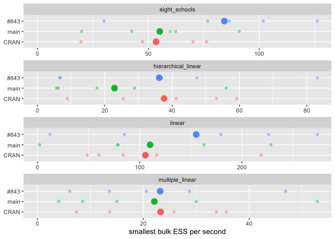
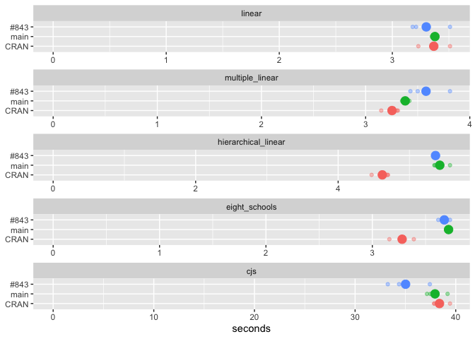
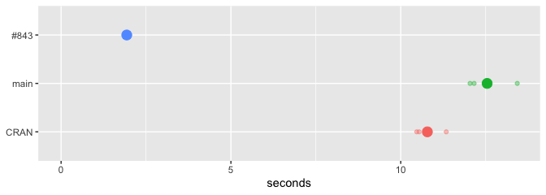

# Retracing on CRAN, main and greta#843


This report compares versions of greta, measured on one machine, at the
quick tier. Every number in it is read from the targets store
2026-10-01-retracing-i546/\_targets-quick. The first version listed is
the reference.

| version | git ref              | commit     | iterations per draw |
|:--------|:---------------------|:-----------|--------------------:|
| CRAN    | v0.6.0               | 026efd63c0 |                   2 |
| main    | main                 | 179021a818 |                   2 |
| \#843   | faster-hessians-i546 | 94ef91b919 |                   2 |

Each version is measured in a process of its own, one after another.
This run did not record the order.

`mcmc()` takes a number of draws, and versions of greta can run
different numbers of iterations per draw: greta 0.6.0 runs two at
`thin = 1`. Each version’s iterations per draw is measured
(`R/iterations.R`), and every `mcmc()` call is given the number of draws
that makes the same number of iterations on every version: 2000 warmup
and 2000 sampling iterations, on 4 chains and 4 cores.

For each model, each version is measured on:

1.  **Speed:** the time it takes to build the model, `opt()`, and
    `mcmc()` of a fixed number of iterations.
2.  **Efficiency:** effective samples per second from those `mcmc()`
    runs, and the time `mcmc()` takes to reach a target effective sample
    size, 3 times.
3.  **Agreement:** the difference between versions’ posterior means, in
    Monte Carlo standard errors.
4.  **Convergence:** R-hat and effective sample size of 3 seeded fits.

Section 5 plots each model’s fitted values and posterior densities, and
section 6 holds any measurements particular to this run. Every `mcmc()`
call uses `hmc()`, greta’s default sampler.

This report compares versions with each other. Whether a version’s
answers are correct is tested in greta itself, in
`tests/testthat/test_posteriors_*.R`: each sampler’s draws are compared
with draws taken from the distribution directly, and Geweke tests check
that alternating between sampling a model’s parameters and simulating
its data keeps their joint distribution.

# The models

Each model is defined in maths and in greta code, and comes from greta’s
`inst/examples/`. Normal and log-normal distributions are written with
their mean and standard deviation, as greta’s `normal()` and
`lognormal()` take them; $\text{Cauchy}^{+}$ is a Cauchy truncated to
positive values. A model’s parameter count is the number of values
`mcmc()` returns for it.

## linear

A regression of each department’s rating in `attitude` on its number of
complaints. Parameters: 3.

$$\begin{aligned}
\text{rating}_i &\sim \text{Normal}(\mu_i, \sigma), \quad i = 1, \dots, 30 \\
\mu_i &= \alpha + \beta \, \text{complaints}_i \\
\alpha, \beta &\sim \text{Normal}(0, 10) \\
\sigma &\sim \text{Cauchy}^{+}(0, 3)
\end{aligned}$$

``` r
int <- normal(0, 10)
coef <- normal(0, 10)
sd <- cauchy(0, 3, truncation = c(0, Inf))
mu <- int + coef * attitude$complaints
distribution(attitude$rating) <- normal(mu, sd)
m <- model(int, coef, sd)
```

## multiple_linear

The same rating on all six of `attitude`’s other columns, $X$, through a
matrix multiply. Parameters: 8.

$$\begin{aligned}
\text{rating}_i &\sim \text{Normal}(\mu_i, \sigma), \quad i = 1, \dots, 30 \\
\mu_i &= \alpha + \sum_{j = 1}^{6} X_{ij} \, \beta_j \\
\alpha, \beta_j &\sim \text{Normal}(0, 10) \\
\sigma &\sim \text{Cauchy}^{+}(0, 3)
\end{aligned}$$

``` r
design <- as.matrix(attitude[, 2:7])
int <- normal(0, 10)
coefs <- normal(0, 10, dim = ncol(design))
sd <- cauchy(0, 3, truncation = c(0, Inf))
mu <- int + design %*% coefs
distribution(attitude$rating) <- normal(mu, sd)
m <- model(int, coefs, sd)
```

## hierarchical_linear

Sepal length on sepal width in `iris`, with an offset for each species,
$s[i]$ being flower $i$’s. Setosa’s offset is zero and the other two
share a scale, $\tau$. The offsets are indexed with `rbind()` and
integer indexing. Parameters: 6.

$$\begin{aligned}
\text{Sepal.Length}_i &\sim \text{Normal}(\mu_i, \sigma), \quad i = 1, \dots, 150 \\
\mu_i &= \alpha + \beta \, \text{Sepal.Width}_i + \gamma_{s[i]} \\
\gamma_1 &= 0, \qquad \gamma_2, \gamma_3 \sim \text{Normal}(0, \tau) \\
\tau &\sim \text{LogNormal}(0, 1) \\
\alpha, \beta &\sim \text{Normal}(0, 10) \\
\sigma &\sim \text{Cauchy}^{+}(0, 3)
\end{aligned}$$

``` r
int <- normal(0, 10)
coef <- normal(0, 10)
sd <- cauchy(0, 3, truncation = c(0, Inf))
species_sd <- lognormal(0, 1)
species_offset <- normal(0, species_sd, dim = 2)
species_effect <- rbind(0, species_offset)
species_id <- as.numeric(iris$Species)
mu <- int + coef * iris$Sepal.Width + species_effect[species_id]
distribution(iris$Sepal.Length) <- normal(mu, sd)
m <- model(int, coef, sd, species_sd, species_offset)
```

## eight_schools

The effect of coaching in eight schools, $y_j$, each measured with a
known standard error, $\sigma_j$. The scale of the school effects,
$\sigma_\eta$, is itself a parameter, which makes the posterior a
funnel. Parameters: 11.

$$\begin{aligned}
y_j &\sim \text{Normal}(\theta_j, \sigma_j), \quad j = 1, \dots, 8 \\
\theta_j &= \mu + \xi \, \eta_j \\
\eta_j &\sim \text{Normal}(0, \sigma_\eta) \\
\sigma_\eta &\sim \text{InverseGamma}(1, 1) \\
\mu &\sim \text{Normal}(0, 100) \\
\xi &\sim \text{Normal}(0, 5)
\end{aligned}$$

``` r
y <- c(28, 8, -3, 7, -1, 1, 18, 12)
sigma_y <- c(15, 10, 16, 11, 9, 11, 10, 18)
N <- length(y)
sigma_eta <- inverse_gamma(1, 1)
eta <- normal(0, sigma_eta, dim = N)
mu_theta <- normal(0, 100)
xi <- normal(0, 5)
theta <- mu_theta + xi * eta
distribution(y) <- normal(theta, sigma_y)
m <- model(sigma_eta, eta, mu_theta, xi)
```

## cjs

A Cormack-Jolly-Seber capture-recapture model: survival, $\phi_t$, and
recapture, $p_t$, on each of 20 occasions, from the simulated capture
histories $y_{it}$ of 100 animals. Animal $i$ is first caught on
occasion $f_i$ and last on $l_i$, so it is known to be alive on every
occasion between. $\chi_t$ is the probability that an animal alive on
occasion $t$ is never seen again, built by a recursion over the 19
earlier occasions. Not measured at the quick tier.

$$\begin{aligned}
\phi_t, \, p_t &\sim \text{Beta}(1, 1), \quad t = 1, \dots, 20 \\
\chi_{20} &= 1, \qquad \chi_t = (1 - \phi_t) + \phi_t \, (1 - p_{t + 1}) \, \chi_{t + 1} \\
1 &\sim \text{Bernoulli}(\phi_{t - 1}), \quad f_i < t \le l_i \\
y_{it} &\sim \text{Bernoulli}(p_t), \quad f_i < t \le l_i \\
1 &\sim \text{Bernoulli}(\chi_{l_i}), \quad \text{if } l_i < 20
\end{aligned}$$

``` r
set.seed(2026)
n_obs <- 100
n_time <- 20
y <- matrix(
  sample(c(0, 1), size = n_obs * n_time, replace = TRUE),
  ncol = n_time
)

first_obs <- apply(y, 1, function(x) min(which(x > 0)))
final_obs <- apply(y, 1, function(x) max(which(x > 0)))
obs_id <- apply(
  y,
  1,
  function(x) {
    seq(min(which(x > 0)), max(which(x > 0)), by = 1)[-1]
  }
)
obs_id <- unlist(obs_id)
capture_vec <- apply(
  y,
  1,
  function(x) x[min(which(x > 0)):max(which(x > 0))][-1]
)
capture_vec <- unlist(capture_vec)

phi <- beta(1, 1, dim = n_time)
p <- beta(1, 1, dim = n_time)

chi <- ones(n_time)
for (i in seq_len(n_time - 1)) {
  tn <- n_time - i
  chi[tn] <- (1 - phi[tn]) + phi[tn] * (1 - p[tn + 1]) * chi[tn + 1]
}

alive_data <- ones(length(obs_id))
not_seen_last <- final_obs != n_time
final_observation <- ones(sum(not_seen_last))

distribution(alive_data) <- bernoulli(phi[obs_id - 1])
distribution(capture_vec) <- bernoulli(p[obs_id])
distribution(final_observation) <- bernoulli(
  chi[final_obs[not_seen_last]]
)

m <- model(phi, p)
```

# 1. Speed

Three tasks are timed on each model, all in one process per version,
after each model has been built, optimised and sampled once so that
nothing timed includes tracing.

**`model`** runs the model’s whole code from “The models” above, from
its first line to its call to `model()`, such as
`m <- model(int, coef, sd)` for linear. It builds a new model each time,
and `bench::mark()` repeats it between 10 and 20 times.

**`opt`**, repeated the same way, on the model built once beforehand:

``` r
opt(m, optimiser = adam(), max_iterations = 100)
```

**`mcmc`**, run 5 times and timed by hand, so that each run’s draws are
kept for section 2. `k` is the version’s iterations per draw:

``` r
mcmc(m, warmup = 2000 / k, n_samples = 2000 / k, chains = 4, n_cores = 4, verbose = FALSE)
```

<div id="fig-speed">


Figure 1: Every timed run, one row per version: the small dots are
single runs and the large dot is their mean. The rows in a panel do the
same calls, so a row further right took longer. Panels are different
tasks and models, on their own scales.

</div>

<details>

<summary>

Table of the median, minimum and maximum, in milliseconds
</summary>

| task | example | CRAN | main | \#843 |
|:---|:---|:---|:---|:---|
| mcmc | eight_schools | 3093.2 (2721.4-3449.7) | 3196.2 (2906.7-3581.4) | 3343.7 (2945.6-3573.8) |
| mcmc | hierarchical_linear | 3980.3 (3811.0-4469.9) | 4013.8 (3830.5-4681.7) | 4355.5 (3778.2-4637.0) |
| mcmc | linear | 2611.7 (2334.2-2762.7) | 2734.1 (2585.7-2911.0) | 2827.5 (2668.4-3189.5) |
| mcmc | multiple_linear | 2882.2 (2623.9-3100.9) | 2639.2 (2526.4-3117.4) | 3010.9 (2731.4-3134.5) |
| model | eight_schools | 22.5 (21.8-32.0) | 20.5 (19.9-26.6) | 24.0 (22.8-74.8) |
| model | hierarchical_linear | 29.3 (28.1-61.5) | 25.7 (25.4-56.0) | 29.3 (28.5-35.0) |
| model | linear | 19.2 (19.0-22.1) | 17.8 (17.5-21.5) | 19.9 (19.5-24.0) |
| model | multiple_linear | 19.7 (19.4-22.3) | 18.1 (17.9-24.5) | 20.6 (20.0-27.7) |
| opt | eight_schools | 127.0 (126.4-135.1) | 82.4 (81.4-89.8) | 88.1 (84.6-96.1) |
| opt | hierarchical_linear | 139.5 (137.6-169.8) | 107.6 (106.4-115.1) | 110.0 (108.4-116.3) |
| opt | linear | 123.6 (122.1-147.0) | 77.0 (76.1-80.2) | 80.8 (77.9-96.0) |
| opt | multiple_linear | 131.7 (122.0-143.6) | 77.2 (76.3-81.4) | 80.1 (78.7-184.8) |

</details>

<details>

<summary>

Table of the ratio of medians for each pair of versions: the first
version named over the second
</summary>

| example             | task  | main vs CRAN | \#843 vs CRAN | \#843 vs main |
|:--------------------|:------|-------------:|--------------:|--------------:|
| eight_schools       | mcmc  |         1.03 |          1.08 |          1.05 |
| hierarchical_linear | mcmc  |         1.01 |          1.09 |          1.09 |
| linear              | mcmc  |         1.05 |          1.08 |          1.03 |
| multiple_linear     | mcmc  |         0.92 |          1.04 |          1.14 |
| eight_schools       | model |         0.91 |          1.07 |          1.17 |
| hierarchical_linear | model |         0.88 |          1.00 |          1.14 |
| linear              | model |         0.92 |          1.03 |          1.12 |
| multiple_linear     | model |         0.91 |          1.04 |          1.14 |
| eight_schools       | opt   |         0.65 |          0.69 |          1.07 |
| hierarchical_linear | opt   |         0.77 |          0.79 |          1.02 |
| linear              | opt   |         0.62 |          0.65 |          1.05 |
| multiple_linear     | opt   |         0.59 |          0.61 |          1.04 |

</details>

# 2. Efficiency

## At a fixed number of iterations

The 5 timed `mcmc()` runs from section 1, each of 2000 warmup and 2000
sampling iterations: the smallest bulk ESS over the model’s variables,
per second of the run, warmup included.

<div id="fig-fixed-efficiency">



Figure 2: Effective samples per second for every fixed-length mcmc()
run: the small dots are single runs and the large dot is their mean.

</div>

<details>

<summary>

Table of the minimum, median and maximum ESS and ESS per second over the
runs
</summary>

| model | version | runs | smallest bulk ESS, median (min-max) | ESS per second, median (min-max) | runs with R-hat \> 1.01 |
|:---|:---|---:|:---|:---|---:|
| eight_schools | CRAN | 5 | 186 (63-235) | 54.0 (19.6-76.3) | 5 |
| eight_schools | main | 5 | 182 (58-291) | 59.9 (19.9-91.0) | 5 |
| eight_schools | \#843 | 5 | 289 (107-408) | 86.5 (30.0-126.2) | 4 |
| hierarchical_linear | CRAN | 5 | 184 (35-250) | 41.2 (8.9-59.2) | 5 |
| hierarchical_linear | main | 5 | 68 (23-262) | 17.7 (5.7-56.1) | 5 |
| hierarchical_linear | \#843 | 5 | 171 (26-366) | 36.9 (6.6-83.1) | 5 |
| linear | CRAN | 5 | 208 (114-605) | 83.8 (48.7-218.8) | 3 |
| linear | main | 5 | 216 (6-665) | 78.9 (2.2-228.4) | 4 |
| linear | \#843 | 5 | 573 (34-820) | 179.5 (12.3-273.9) | 2 |
| multiple_linear | CRAN | 5 | 71 (19-111) | 25.8 (7.4-35.7) | 5 |
| multiple_linear | main | 5 | 38 (11-165) | 15.0 (4.0-52.9) | 5 |
| multiple_linear | \#843 | 5 | 64 (18-131) | 20.6 (6.1-46.9) | 5 |

</details>

## Time to a target ESS

Seconds of sampling per 1000 effective draws: `mcmc()` with 2000 warmup
and 2000 sampling iterations, then `extra_samples()` until the smallest
bulk ESS over the model’s variables reaches 200 and every R-hat is below
1.01, or until the tier’s time limit. Each version runs this 3 times per
model. A run that reaches the time limit is marked `hit_cap` in the
table of sampling runs under Details.

<div id="fig-sampling">


Figure 3: Seconds of sampling per 1000 effective draws. With one run per
version and model, a bar is that run; with several, each dot is a run.

</div>

<details>

<summary>

Table of the median for each version, the ratio of medians for each
pair, and the number of runs
</summary>

| model | CRAN (s) | main (s) | \#843 (s) | main vs CRAN | \#843 vs CRAN | \#843 vs main | runs |
|:---|---:|---:|---:|---:|---:|---:|---:|
| eight_schools | 9.95 | 13.96 | 11.31 | 1.40 | 1.14 | 0.81 | 3 |
| hierarchical_linear | 28.73 | 24.34 | 37.21 | 0.85 | 1.30 | 1.53 | 3 |
| linear | 5.80 | 10.25 | 17.41 | 1.77 | 3.00 | 1.70 | 3 |
| multiple_linear | 26.50 | 23.70 | 41.13 | 0.89 | 1.55 | 1.74 | 3 |

</details>

## Memory

| version | RSS (MB) |
|:--------|---------:|
| CRAN    |     1305 |
| main    |     1016 |
| \#843   |     1349 |

- RSS is resident set size: the physical memory the measuring process
  held, in MB.
- It is read once, at the end of each version’s run, so it covers every
  task together, and it is not a peak.
- It is used rather than `bench`’s `mem_alloc`, which sees only R’s
  memory. Most of greta’s memory is held by TensorFlow, on the Python
  side.

# 3. Agreement

For each variable, the difference between two versions’ posterior means,
divided by the Monte Carlo standard error of that difference (Vehtari et
al. 2021; Magnusson et al. 2025), from the runs in section 2:

$$z = \frac{\bar\theta_{\text{test}} - \bar\theta_{\text{ref}}}{\sqrt{\text{mcse}^2_{\text{test}} + \text{mcse}^2_{\text{ref}}}}$$

The table counts the variables with $|z| > 4$.

<div id="fig-agreement">


Figure 4: Every variable’s difference in means, in MCSE units, for each
pair of versions. The shaded band is \|z\| up to 4.

</div>

<details>

<summary>

Table of the largest \|z\| for each model and pair of versions
</summary>

| comparison | model | variables | largest \|z\| | variables with \|z\| \> 4 | variable with the largest \|z\| |
|:---|:---|---:|---:|---:|:---|
| main vs CRAN | eight_schools | 11 | 2.34 | 0 | eta\[8,1\] |
| main vs CRAN | hierarchical_linear | 6 | 1.60 | 0 | sd |
| main vs CRAN | linear | 3 | 0.52 | 0 | sd |
| main vs CRAN | multiple_linear | 8 | 0.89 | 0 | coefs\[2,1\] |
| \#843 vs CRAN | eight_schools | 11 | 1.26 | 0 | eta\[1,1\] |
| \#843 vs CRAN | hierarchical_linear | 6 | 2.22 | 0 | coef |
| \#843 vs CRAN | linear | 3 | 1.20 | 0 | sd |
| \#843 vs CRAN | multiple_linear | 8 | 1.10 | 0 | sd |
| \#843 vs main | eight_schools | 11 | 1.88 | 0 | sigma_eta |
| \#843 vs main | hierarchical_linear | 6 | 1.53 | 0 | coef |
| \#843 vs main | linear | 3 | 0.76 | 0 | sd |
| \#843 vs main | multiple_linear | 8 | 1.71 | 0 | coefs\[3,1\] |

</details>

# 4. Convergence

R-hat and effective sample size over each model’s variables, for 3
seeded fits of each model on each version, with seeds 1 to 3: 4 chains
of 2000 warmup and 2000 sampling iterations each. Versions whose
`mcmc()` follows `set.seed()` start each seed from the same random
numbers; greta 0.6.0’s does not.

<div id="fig-diagnostics">


Figure 5: Bulk ESS of each fit over the model’s variables, one line per
seed: the line runs from the smallest to the largest, the point is the
median. The dashed line is 400. Log scale.

</div>

<details>

<summary>

Table of R-hat and ESS for each fit
</summary>

| model | version | seed | largest R-hat | bulk ESS, min | bulk ESS, median | bulk ESS, max | tail ESS, min |
|:---|:---|---:|---:|---:|---:|---:|---:|
| eight_schools | CRAN | 1 | 1.020 | 260 | 1612 | 2687 | 362 |
| eight_schools | CRAN | 2 | 1.032 | 95 | 2225 | 2517 | 16 |
| eight_schools | CRAN | 3 | 1.011 | 344 | 2286 | 2735 | 274 |
| eight_schools | main | 1 | 1.083 | 36 | 104 | 1843 | 14 |
| eight_schools | main | 2 | 1.016 | 300 | 2360 | 2744 | 311 |
| eight_schools | main | 3 | 1.018 | 215 | 1311 | 3150 | 219 |
| eight_schools | \#843 | 1 | 1.083 | 36 | 104 | 1843 | 14 |
| eight_schools | \#843 | 2 | 1.016 | 300 | 2360 | 2744 | 311 |
| eight_schools | \#843 | 3 | 1.018 | 215 | 1311 | 3150 | 219 |
| hierarchical_linear | CRAN | 1 | 1.028 | 138 | 258 | 3009 | 118 |
| hierarchical_linear | CRAN | 2 | 1.025 | 70 | 86 | 2621 | 130 |
| hierarchical_linear | CRAN | 3 | 1.026 | 110 | 184 | 2925 | 287 |
| hierarchical_linear | main | 1 | 1.012 | 181 | 264 | 3092 | 342 |
| hierarchical_linear | main | 2 | 1.079 | 53 | 85 | 3293 | 59 |
| hierarchical_linear | main | 3 | 1.080 | 48 | 112 | 3190 | 144 |
| hierarchical_linear | \#843 | 1 | 1.012 | 181 | 264 | 3092 | 342 |
| hierarchical_linear | \#843 | 2 | 1.079 | 53 | 85 | 3293 | 59 |
| hierarchical_linear | \#843 | 3 | 1.080 | 48 | 112 | 3190 | 144 |
| linear | CRAN | 1 | 1.015 | 161 | 169 | 2564 | 322 |
| linear | CRAN | 2 | 1.002 | 938 | 945 | 1256 | 1199 |
| linear | CRAN | 3 | 1.088 | 36 | 42 | 1461 | 170 |
| linear | main | 1 | 1.010 | 330 | 347 | 2922 | 487 |
| linear | main | 2 | 1.003 | 1035 | 1056 | 1641 | 1635 |
| linear | main | 3 | 1.061 | 75 | 81 | 1584 | 171 |
| linear | \#843 | 1 | 1.010 | 330 | 347 | 2922 | 487 |
| linear | \#843 | 2 | 1.003 | 1035 | 1056 | 1641 | 1635 |
| linear | \#843 | 3 | 1.061 | 75 | 81 | 1584 | 171 |
| multiple_linear | CRAN | 1 | 1.031 | 143 | 219 | 1308 | 309 |
| multiple_linear | CRAN | 2 | 1.084 | 66 | 135 | 525 | 95 |
| multiple_linear | CRAN | 3 | 1.118 | 24 | 60 | 660 | 66 |
| multiple_linear | main | 1 | 1.552 | 7 | 346 | 428 | 21 |
| multiple_linear | main | 2 | 1.050 | 84 | 185 | 1783 | 194 |
| multiple_linear | main | 3 | 1.523 | 8 | 123 | 784 | 30 |
| multiple_linear | \#843 | 1 | 1.552 | 7 | 346 | 428 | 21 |
| multiple_linear | \#843 | 2 | 1.050 | 84 | 185 | 1783 | 194 |
| multiple_linear | \#843 | 3 | 1.523 | 8 | 123 | 784 | 30 |

</details>

# 5. Fits

The seed 1 fit of each model from section 4. Each version is a colour.
The fitted values are each model’s expected value for the data, such as
its regression line, not new data simulated from the model. The data are
the black points.

## linear

<div id="fig-fit-linear">


Figure 6: The fitted line’s median and 95% interval.

</div>

<div id="fig-densities-linear">


Figure 7: Posterior densities.

</div>

## multiple_linear

<div id="fig-fit-multiple-linear">


Figure 8: Each fitted value’s median, 50% and 95% intervals, against the
value it fits. The dashed line is where the two are equal.

</div>

<div id="fig-densities-multiple-linear">


Figure 9: Posterior densities.

</div>

## hierarchical_linear

<div id="fig-fit-hierarchical-linear">


Figure 10: The fitted line’s median and 95% interval, by species.

</div>

<div id="fig-densities-hierarchical-linear">


Figure 11: Posterior densities.

</div>

## eight_schools

<div id="fig-fit-eight-schools">


Figure 12: Each school’s estimated effect: median, 50% and 95%
intervals. The black points are the observed effects.

</div>

<div id="fig-densities-eight-schools">


Figure 13: Posterior densities of the first eight variables.

</div>

## cjs

Not measured at the quick tier.

# 6. Further measurements

greta#546 is about tracing: the first time greta calls one of a model’s
TensorFlow functions in a session, TensorFlow runs greta’s R code to
record the function, and records it again for each input shape it has
not seen. Section 1 times calls after that has happened. These runs time
calls that include it.

## Tracing in `mcmc()`

`tracing-run.qmd`, rendered 3 times against each version by
`02-tracing-runs.R`, each time in a fresh R session with only that
version installed. Each render runs the five models above with `mcmc()`,
4 chains of 2000 warmup and 2000 sampling iterations on 4 cores. Each
call is the first for its model in that session, so its time includes
tracing. It records how many times each of the model’s three traced
functions was traced, and how many retracing warnings TensorFlow logged.
The documents linked are each version’s last run:

- CRAN: [html](tracing-run-v0.6.0.html),
  [markdown](tracing-run-v0.6.0.md), at
  [026efd63](https://github.com/greta-dev/greta/commit/026efd63c08893f65de582b232c0748afaf72127)
- main: [html](tracing-run-main.html), [markdown](tracing-run-main.md),
  at
  [179021a8](https://github.com/greta-dev/greta/commit/179021a818cd7282896c42b03814a53556c1d98d)
- \#843: [html](tracing-run-faster-hessians-i546.html),
  [markdown](tracing-run-faster-hessians-i546.md), at
  [94ef91b9](https://github.com/greta-dev/greta/commit/94ef91b919300d33474aa3273cbb1f49cb989373)

<div id="fig-traces">


Figure 14: How many times each of the model’s traced functions was
traced during its first mcmc() call. One dot per run; runs with the same
count overlap.

</div>

<div id="fig-tracing-seconds">



Figure 15: Seconds for each model’s first mcmc() call, tracing included:
the small dots are runs and the large dot is their mean. Each model has
its own scale, starting at zero.

</div>

<details>

<summary>

Table of every run
</summary>

| model | version | run | seconds | retracing warnings | log-prob traces | trace-values traces | sampler traces |
|:---|:---|---:|---:|---:|---:|---:|---:|
| linear | CRAN | 1 | 3.51 | 0 | 2 | 2 | 1 |
| linear | CRAN | 2 | 3.23 | 0 | 2 | 2 | 1 |
| linear | CRAN | 3 | 3.36 | 0 | 2 | 2 | 1 |
| linear | main | 1 | 3.35 | 0 | 2 | 2 | 1 |
| linear | main | 2 | 3.39 | 0 | 2 | 2 | 1 |
| linear | main | 3 | 3.39 | 0 | 2 | 2 | 1 |
| linear | \#843 | 1 | 3.21 | 0 | 1 | 1 | 1 |
| linear | \#843 | 2 | 3.18 | 0 | 1 | 1 | 1 |
| linear | \#843 | 3 | 3.51 | 0 | 1 | 1 | 1 |
| multiple_linear | CRAN | 1 | 3.30 | 0 | 2 | 2 | 1 |
| multiple_linear | CRAN | 2 | 3.15 | 0 | 2 | 2 | 1 |
| multiple_linear | CRAN | 3 | 3.31 | 0 | 2 | 2 | 1 |
| multiple_linear | main | 1 | 3.37 | 0 | 2 | 2 | 1 |
| multiple_linear | main | 2 | 3.42 | 0 | 2 | 2 | 1 |
| multiple_linear | main | 3 | 3.35 | 0 | 2 | 2 | 1 |
| multiple_linear | \#843 | 1 | 3.50 | 0 | 1 | 1 | 1 |
| multiple_linear | \#843 | 2 | 3.81 | 0 | 1 | 1 | 1 |
| multiple_linear | \#843 | 3 | 3.43 | 0 | 1 | 1 | 1 |
| hierarchical_linear | CRAN | 1 | 4.69 | 0 | 2 | 2 | 1 |
| hierarchical_linear | CRAN | 2 | 4.47 | 0 | 2 | 2 | 1 |
| hierarchical_linear | CRAN | 3 | 4.70 | 0 | 2 | 2 | 1 |
| hierarchical_linear | main | 1 | 5.57 | 0 | 2 | 2 | 1 |
| hierarchical_linear | main | 2 | 5.36 | 0 | 2 | 2 | 1 |
| hierarchical_linear | main | 3 | 5.35 | 0 | 2 | 2 | 1 |
| hierarchical_linear | \#843 | 1 | 5.36 | 0 | 1 | 1 | 1 |
| hierarchical_linear | \#843 | 2 | 5.39 | 0 | 1 | 1 | 1 |
| hierarchical_linear | \#843 | 3 | 5.35 | 0 | 1 | 1 | 1 |
| eight_schools | CRAN | 1 | 3.39 | 0 | 2 | 2 | 1 |
| eight_schools | CRAN | 2 | 3.16 | 0 | 2 | 2 | 1 |
| eight_schools | CRAN | 3 | 3.29 | 0 | 2 | 2 | 1 |
| eight_schools | main | 1 | 3.73 | 0 | 2 | 2 | 1 |
| eight_schools | main | 2 | 3.72 | 0 | 2 | 2 | 1 |
| eight_schools | main | 3 | 3.70 | 0 | 2 | 2 | 1 |
| eight_schools | \#843 | 1 | 3.68 | 0 | 1 | 1 | 1 |
| eight_schools | \#843 | 2 | 3.62 | 0 | 1 | 1 | 1 |
| eight_schools | \#843 | 3 | 3.73 | 0 | 1 | 1 | 1 |
| cjs | CRAN | 1 | 39.43 | 0 | 2 | 2 | 1 |
| cjs | CRAN | 2 | 37.88 | 0 | 2 | 2 | 1 |
| cjs | CRAN | 3 | 37.85 | 0 | 2 | 2 | 1 |
| cjs | main | 1 | 39.19 | 0 | 2 | 2 | 1 |
| cjs | main | 2 | 37.15 | 0 | 2 | 2 | 1 |
| cjs | main | 3 | 37.48 | 0 | 2 | 2 | 1 |
| cjs | \#843 | 1 | 37.43 | 0 | 1 | 1 | 1 |
| cjs | \#843 | 2 | 33.25 | 0 | 1 | 1 | 1 |
| cjs | \#843 | 3 | 34.37 | 0 | 1 | 1 | 1 |

</details>

## Tracing in `opt(hessian = TRUE)`, on twenty scalar targets

The model greta#546 reported: twenty observations $y_k$, simulated, each
with its own mean $b_k$, so `opt(hessian = TRUE)` takes twenty hessians.
greta’s `variable()` gives $b_k$ a flat prior, so it has no distribution
line.

$$y_k \sim \text{Normal}(b_k, 1), \quad k = 1, \dots, 20$$

``` r
set.seed(2026 - 09 - 29)
y <- rnorm(20)

# twenty separate scalar parameters, b1 to b20
target_names <- paste0("b", 1:20)
for (name in target_names) {
  assign(name, variable())
}
distribution(y) <- normal(do.call(c, mget(target_names)), 1)

# model() names its targets from the expressions it is given, so the call is
# built from the names: this is model(b1, b2, ..., b20)
m <- eval(as.call(c(quote(model), lapply(target_names, as.name))))
```

`opt(m, hessian = TRUE)`, timed in the same documents, as the first
`opt()` call in each session:

<div id="fig-hessian">



Figure 16: Seconds for opt(hessian = TRUE) on twenty scalar targets, as
the first opt() call in a session: the small dots are runs and the large
dot is their mean.

</div>

<details>

<summary>

Table of every run
</summary>

| version | run | seconds | retracing warnings |
|:--------|----:|--------:|-------------------:|
| CRAN    |   1 |   11.34 |                  2 |
| CRAN    |   2 |   10.54 |                  2 |
| CRAN    |   3 |   10.47 |                  2 |
| main    |   1 |   12.16 |                  2 |
| main    |   2 |   13.43 |                  2 |
| main    |   3 |   12.04 |                  2 |
| \#843   |   1 |    2.00 |                  0 |
| \#843   |   2 |    1.93 |                  0 |
| \#843   |   3 |    1.87 |                  0 |

</details>

# Details

<div class="panel-tabset">

## Sampling runs

|  | version | example | rep | elapsed | mcmc_iterations | ess_bulk_min | ess_bulk_median | rhat_max | n_variables | hit_cap |
|:---|:---|:---|---:|---:|---:|---:|---:|---:|---:|:---|
| linear…1 | CRAN | linear | 1 | 2.86 | 2000 | 395.91 | 407.21 | 1.01 | 3 | FALSE |
| multiple_linear…2 | CRAN | multiple_linear | 1 | 6.46 | 6430 | 231.22 | 677.29 | 1.01 | 8 | FALSE |
| hierarchical_linear…3 | CRAN | hierarchical_linear | 1 | 12.00 | 9914 | 417.78 | 709.23 | 1.01 | 6 | FALSE |
| eight_schools…4 | CRAN | eight_schools | 1 | 3.62 | 2400 | 330.73 | 1559.33 | 1.01 | 11 | FALSE |
| linear1…5 | CRAN | linear | 2 | 3.01 | 2000 | 520.15 | 537.81 | 1.00 | 3 | FALSE |
| multiple_linear1…6 | CRAN | multiple_linear | 2 | 5.42 | 5266 | 219.55 | 595.78 | 1.01 | 8 | FALSE |
| hierarchical_linear1…7 | CRAN | hierarchical_linear | 2 | 7.05 | 4080 | 253.87 | 367.82 | 1.01 | 6 | FALSE |
| eight_schools1…8 | CRAN | eight_schools | 2 | 6.36 | 4400 | 638.55 | 4651.07 | 1.01 | 11 | FALSE |
| linear2…9 | CRAN | linear | 3 | 2.99 | 2000 | 589.55 | 600.69 | 1.01 | 3 | FALSE |
| multiple_linear2…10 | CRAN | multiple_linear | 3 | 12.85 | 14106 | 484.95 | 955.87 | 1.01 | 8 | FALSE |
| hierarchical_linear2…11 | CRAN | hierarchical_linear | 3 | 23.31 | 18104 | 483.27 | 590.43 | 1.01 | 6 | FALSE |
| eight_schools2…12 | CRAN | eight_schools | 3 | 3.22 | 2000 | 455.49 | 1654.59 | 1.01 | 11 | FALSE |
| linear…13 | main | linear | 1 | 4.16 | 3792 | 316.81 | 336.85 | 1.01 | 3 | FALSE |
| multiple_linear…14 | main | multiple_linear | 1 | 7.71 | 10608 | 325.29 | 931.27 | 1.01 | 8 | FALSE |
| hierarchical_linear…15 | main | hierarchical_linear | 1 | 8.43 | 4874 | 534.37 | 629.15 | 1.01 | 6 | FALSE |
| eight_schools…16 | main | eight_schools | 1 | 6.52 | 4514 | 435.72 | 2205.87 | 1.01 | 11 | FALSE |
| linear1…17 | main | linear | 2 | 3.96 | 3000 | 386.58 | 415.12 | 1.01 | 3 | FALSE |
| multiple_linear1…18 | main | multiple_linear | 2 | 9.27 | 13600 | 742.60 | 956.14 | 1.01 | 8 | FALSE |
| hierarchical_linear1…19 | main | hierarchical_linear | 2 | 7.06 | 3818 | 290.18 | 458.48 | 1.01 | 6 | FALSE |
| eight_schools1…20 | main | eight_schools | 2 | 3.91 | 2000 | 280.37 | 2466.05 | 1.01 | 11 | FALSE |
| linear2…21 | main | linear | 3 | 3.87 | 3000 | 574.75 | 596.58 | 1.01 | 3 | FALSE |
| multiple_linear2…22 | main | multiple_linear | 3 | 25.48 | 42000 | 369.16 | 4300.49 | 1.01 | 8 | FALSE |
| hierarchical_linear2…23 | main | hierarchical_linear | 3 | 36.51 | 17818 | 678.91 | 1694.52 | 1.01 | 6 | FALSE |
| eight_schools2…24 | main | eight_schools | 3 | 11.39 | 7292 | 954.53 | 7288.88 | 1.01 | 11 | FALSE |
| linear…25 | \#843 | linear | 1 | 3.67 | 2630 | 210.67 | 221.42 | 1.00 | 3 | FALSE |
| multiple_linear…26 | \#843 | multiple_linear | 1 | 35.46 | 55976 | 225.58 | 6896.17 | 1.00 | 8 | FALSE |
| hierarchical_linear…27 | \#843 | hierarchical_linear | 1 | 17.78 | 12436 | 433.40 | 907.67 | 1.01 | 6 | FALSE |
| eight_schools…28 | \#843 | eight_schools | 1 | 4.03 | 2750 | 260.60 | 2140.07 | 1.01 | 11 | FALSE |
| linear1…29 | \#843 | linear | 2 | 6.42 | 6420 | 304.71 | 321.01 | 1.01 | 3 | FALSE |
| multiple_linear1…30 | \#843 | multiple_linear | 2 | 10.66 | 12068 | 449.35 | 869.38 | 1.01 | 8 | FALSE |
| hierarchical_linear1…31 | \#843 | hierarchical_linear | 2 | 12.91 | 11802 | 346.82 | 465.27 | 1.01 | 6 | FALSE |
| eight_schools1…32 | \#843 | eight_schools | 2 | 3.72 | 2000 | 329.00 | 1377.29 | 1.01 | 11 | FALSE |
| linear2…33 | \#843 | linear | 3 | 3.12 | 2000 | 456.24 | 513.24 | 1.01 | 3 | FALSE |
| multiple_linear2…34 | \#843 | multiple_linear | 3 | 25.41 | 15764 | 617.74 | 1663.31 | 1.01 | 8 | FALSE |
| hierarchical_linear2…35 | \#843 | hierarchical_linear | 3 | 8.65 | 4498 | 309.50 | 565.85 | 1.01 | 6 | FALSE |
| eight_schools2…36 | \#843 | eight_schools | 3 | 3.48 | 2400 | 308.52 | 1774.56 | 1.01 | 11 | FALSE |

## Posteriors

The mean and 90% interval, the 5% to 95% quantiles, of each model’s six
widest variables, from the runs in section 2.

<div id="fig-intervals">


Figure 17

</div>

## Provenance

    List of 5
     $ run_at  : chr "2026-10-02 11:32:29 AEST"
     $ cpu     : chr "Apple M3"
     $ cores   : int 8
     $ platform:List of 11
      ..$ version : chr "R version 4.6.1 (2026-06-24)"
      ..$ os      : chr "macOS Tahoe 26.5.2"
      ..$ system  : chr "aarch64, darwin23"
      ..$ ui      : chr "X11"
      ..$ language: chr "(EN)"
      ..$ collate : chr "en_AU.UTF-8"
      ..$ ctype   : chr "en_AU.UTF-8"
      ..$ tz      : chr "Australia/Hobart"
      ..$ date    : chr "2026-10-02"
      ..$ pandoc  : chr "3.10 @ /opt/homebrew/bin/ (via rmarkdown)"
      ..$ quarto  : chr "1.9.36 @ /usr/local/bin/quarto"
      ..- attr(*, "class")= chr [1:2] "platform_info" "list"
     $ packages:Classes 'packages_info' and 'data.frame':   4 obs. of  11 variables:
      ..$ package      : chr [1:4] "bench" "cross" "reticulate" "tensorflow"
      ..$ ondiskversion: chr [1:4] "1.1.4" "0.0.0.9000" "1.47.0" "2.20.0"
      ..$ loadedversion: chr [1:4] "1.1.4" "0.0.0.9000" NA NA
      ..$ path         : chr [1:4] "/Library/Frameworks/R.framework/Versions/4.6/Resources/library/bench" "/Library/Frameworks/R.framework/Versions/4.6/Resources/library/cross" "/Users/nick_1/Library/R/arm64/4.6/library/reticulate" "/Users/nick_1/Library/R/arm64/4.6/library/tensorflow"
      ..$ loadedpath   : chr [1:4] "/Library/Frameworks/R.framework/Versions/4.6/Resources/library/bench" "/Library/Frameworks/R.framework/Versions/4.6/Resources/library/cross" NA NA
      ..$ attached     : logi [1:4] TRUE TRUE FALSE FALSE
      ..$ is_base      : logi [1:4] FALSE FALSE FALSE FALSE
      ..$ date         : chr [1:4] "2025-01-16" "2026-08-05" "2026-09-03" "2025-08-22"
      ..$ source       : chr [1:4] "CRAN (R 4.6.0)" "Github (DavisVaughan/cross@1a0db276e1f14b404efa6305b7890ffe24690f1d)" "CRAN (R 4.6.1)" "CRAN (R 4.6.0)"
      ..$ md5ok        : logi [1:4] NA NA NA NA
      ..$ library      : Factor w/ 2 levels "/Users/nick_1/Library/R/arm64/4.6/library",..: 2 2 1 1

</div>

# Methods

**Diagnostics.** Rank-normalised split-R̂ and bulk and tail effective
sample size (Vehtari et al. 2021). ESS above 400 is where the
diagnostics become reliable, not where accuracy becomes sufficient.
`coda::effectiveSize()` is not used: it fits an AR model per chain with
no between-chain information, so it reports a large ESS for chains stuck
in different modes.

**Comparing posteriors.** Differences in posterior means are divided by
the combined Monte Carlo standard error, so bias is separable from Monte
Carlo noise (Magnusson et al. 2025). A two-sample Kolmogorov-Smirnov
test on the draws is not used: it assumes both samples are independent
draws, and MCMC draws are autocorrelated, so a correct sampler is
rejected too often (Talts et al. 2018). With one $z$ per variable, the
largest of many exceeds 2 routinely, so the table counts variables
beyond 4.

**Timing.** Timing noise is one-sided (Chen and Revels 2016): a run can
be slowed by something else on the machine, never sped up. The plots
show every run so the spread can be read beside the mean. Sampling
measurements vary between runs of the same version, so each is repeated:
three times at the quick tier and five at the standard and thorough.
Effect sizes are reported rather than significance tests (Kalibera and
Jones 2013).

**What is not measured.** Gradient evaluations are not counted, so a
difference in wall time cannot be split into fewer gradients and cheaper
gradients (Hoffman et al. 2021). There is no external reference
posterior, so a bug present in every version would not show; posteriordb
(Magnusson et al. 2025) and Inference Gym hold reference posteriors.

# References

<div id="refs" class="references csl-bib-body hanging-indent">

<div id="ref-chen2016" class="csl-entry">

Chen, Jiahao, and Jarrett Revels. 2016. “Robust Benchmarking in Noisy
Environments.” *arXiv Preprint*. <https://arxiv.org/abs/1608.04295>.

</div>

<div id="ref-hoffman2021" class="csl-entry">

Hoffman, Matthew D., Alexey Radul, and Pavel Sountsov. 2021. “An
Adaptive-MCMC Scheme for Setting Trajectory Lengths in Hamiltonian Monte
Carlo.” *Proceedings of the 24th International Conference on Artificial
Intelligence and Statistics (AISTATS)*.

</div>

<div id="ref-kalibera2013" class="csl-entry">

Kalibera, Tomas, and Richard Jones. 2013. “Rigorous Benchmarking in
Reasonable Time.” *Proceedings of the 2013 International Symposium on
Memory Management (ISMM)*, 63–74.
<https://doi.org/10.1145/2464157.2464160>.

</div>

<div id="ref-magnusson2025" class="csl-entry">

Magnusson, Måns, Jakob Torgander, Paul-Christian Bürkner, Lu Zhang, Bob
Carpenter, and Aki Vehtari. 2025. “Posteriordb: Testing, Benchmarking
and Developing Bayesian Inference Algorithms.” *Proceedings of the 28th
International Conference on Artificial Intelligence and Statistics
(AISTATS)*. <https://arxiv.org/abs/2407.04967>.

</div>

<div id="ref-talts2018" class="csl-entry">

Talts, Sean, Michael Betancourt, Daniel Simpson, Aki Vehtari, and Andrew
Gelman. 2018. “Validating Bayesian Inference Algorithms with
Simulation-Based Calibration.” *arXiv Preprint*.
<https://arxiv.org/abs/1804.06788>.

</div>

<div id="ref-vehtari2021" class="csl-entry">

Vehtari, Aki, Andrew Gelman, Daniel Simpson, Bob Carpenter, and
Paul-Christian Bürkner. 2021. “Rank-Normalization, Folding, and
Localization: An Improved R̂ for Assessing Convergence of MCMC (with
Discussion).” *Bayesian Analysis* 16 (2): 667–718.
<https://doi.org/10.1214/20-BA1221>.

</div>

</div>
